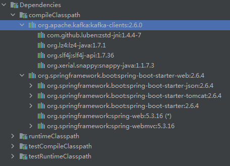

## SpringBoot依赖管理的能力

SpringBoot管理的依赖有1000多个，详见[Dependency Versions (spring.io)](https://docs.spring.io/spring-boot/docs/current/reference/html/dependency-versions.html)。这些组件，在和SpringBoot一起使用的时候，可以不指定版本，因为SpringBoot预定义了合适的版本。这样做的好处是大大降低了依赖冲突的概率。

例如，对于这样一个项目（使用了web和kafka-clients）：

```gradle
plugins {
    id 'org.springframework.boot' version '2.6.4'
    id 'io.spring.dependency-management' version '1.0.11.RELEASE'
    id 'java'
}

group = 'cn.whu.wy'
version = '0.0.1-SNAPSHOT'
sourceCompatibility = '11'

repositories {
    maven { url 'https://maven.aliyun.com/repository/public' }
    mavenCentral()
}

dependencies {
    implementation 'org.springframework.boot:spring-boot-starter-web'
    implementation group: 'org.apache.kafka', name: 'kafka-clients', version: '2.6.0'

    testImplementation 'org.springframework.boot:spring-boot-starter-test'
}

tasks.named('test') {
    useJUnitPlatform()
}
```

指定了kafka-clients使用2.6.0版本，依赖面板显示：



实际上，由于kafka-clients也纳入了SpringBoot的依赖管理，可以不指定版本号。去掉`version: '2.6.0'`之后，依赖面板显示：


可见，SpringBoot 2.6.4预定义的Kafka版本为3.0。


## SpringBoot的依赖

在[Spring Initializr](https://start.spring.io/)上创建一个简单的SpringBoot项目（web+jdbc），生成的依赖为：

```gradle
plugins {
  id 'org.springframework.boot' version '2.7.0'
  id 'io.spring.dependency-management' version '1.0.11.RELEASE'
  id 'java'
}

group = 'com.example'
version = '0.0.1-SNAPSHOT'
sourceCompatibility = '11'

configurations {
  compileOnly {
    extendsFrom annotationProcessor
  }
}

repositories {
  mavenCentral()
}

dependencies {
  implementation 'org.springframework.boot:spring-boot-starter-jdbc'
  implementation 'org.springframework.boot:spring-boot-starter-web'
  compileOnly 'org.projectlombok:lombok'
  runtimeOnly 'mysql:mysql-connector-java'
  annotationProcessor 'org.projectlombok:lombok'
  testImplementation 'org.springframework.boot:spring-boot-starter-test'
}

tasks.named('test') {
  useJUnitPlatform()
}

```

## SpringCloud的依赖

如果还勾选了SpringCloud的组件（如openfeign），生成的依赖为：

```gradle
plugins {
  id 'org.springframework.boot' version '2.7.0'
  id 'io.spring.dependency-management' version '1.0.11.RELEASE'
  id 'java'
}

group = 'com.example'
version = '0.0.1-SNAPSHOT'
sourceCompatibility = '11'

configurations {
  compileOnly {
    extendsFrom annotationProcessor
  }
}

repositories {
  mavenCentral()
}

ext {
  set('springCloudVersion', "2021.0.3")
}

dependencies {
  implementation 'org.springframework.boot:spring-boot-starter-jdbc'
  implementation 'org.springframework.boot:spring-boot-starter-web'
  implementation 'org.springframework.cloud:spring-cloud-starter-openfeign'
  compileOnly 'org.projectlombok:lombok'
  runtimeOnly 'mysql:mysql-connector-java'
  annotationProcessor 'org.projectlombok:lombok'
  testImplementation 'org.springframework.boot:spring-boot-starter-test'
}

dependencyManagement {
  imports {
    mavenBom "org.springframework.cloud:spring-cloud-dependencies:${springCloudVersion}"
  }
}

tasks.named('test') {
  useJUnitPlatform()
}
```

可见，比起只使用SpringBoot的组件，多了以下内容：

```gradle
ext {
  set('springCloudVersion', "2021.0.3")
}

dependencyManagement {
  imports {
    mavenBom "org.springframework.cloud:spring-cloud-dependencies:${springCloudVersion}"
  }
}
```

## org.springframework.boot与io.spring.dependency-management的区别

上面的几个示例都使用了两个插件：org.springframework.boot（以下简称springboot插件）和io.spring.dependency-management（以下简称dependency-management插件）。这俩有什么区别？

springboot插件表示这是一个SpringBoot项目，可以build为一个可执行的jar包（使用下图build面板下的bootJar命令），项目里面必须有一个使用`@SpringBootApplication`标记的类，该类是可执行jar的入口类。


dependency-management插件，从名字就能看出来是管理依赖的。如下图，`help`下面的`dependencyXXX`等命令就是该插件提供的：


双击运行dependencyManagement命令，会打印出Default dependency management for all configurations：


这些配置就是你正在用的SpringBoot版本所管理的依赖，与docs.spring.io上提供的是一致的。比如我正在使用SpringBoot 2.6.4，dependencyManagement命令打印的内容与[https://docs.spring.io/spring-boot/docs/2.6.4/reference/html/dependency-versions.html](https://docs.spring.io/spring-boot/docs/2.6.4/reference/html/dependency-versions.html)相同。

### 两个插件的联系

> When you apply the [`io.spring.dependency-management`](https://github.com/spring-gradle-plugins/dependency-management-plugin) plugin, Spring Boot’s plugin will automatically [import the `spring-boot-dependencies` bom](https://docs.spring.io/spring-boot/docs/current/gradle-plugin/reference/htmlsingle/#reacting-to-other-plugins.dependency-management) from the version of Spring Boot that you are using.

## 非SpringBoot项目如何使用SpringBoot管理依赖

Ref：[Using Spring Boot's Dependency Management in Isolation](https://docs.spring.io/spring-boot/docs/current/gradle-plugin/reference/htmlsingle/#managing-dependencies.dependency-management-plugin.using-in-isolation)

有些项目并不是SpringBoot项目（不需要build为可执行的jar包），又想使用SpringBoot的依赖管理功能，该怎么做？

```gradle
plugins {
    // configure the project to depend on the Spring Boot plugin but do not apply it:
    id 'org.springframework.boot' version '2.6.4' apply false // look here!
    id 'java'
}

// add this
apply plugin: 'io.spring.dependency-management'

dependencyManagement {
    imports {
        mavenBom(org.springframework.boot.gradle.plugin.SpringBootPlugin.BOM_COORDINATES)
    }
}
```

## gradle legacy plugin application（老式写法）

以下是一个具备依赖管理功能的**可运行**的SpringBoot项目：

```gradle
buildscript {
  repositories {
    maven { url "https://plugins.gradle.org/m2/" }
  }
  dependencies {
    classpath "org.springframework.boot:spring-boot-gradle-plugin:2.7.0"
    classpath "io.spring.gradle:dependency-management-plugin:1.0.11.RELEASE"
  }
}

apply plugin: "org.springframework.boot" 
apply plugin: "io.spring.dependency-management"

// 下面的group、version、sourceCompatibility、repositories{}、dependencyManagement{}、dependencies{} 等是一样的，略
```

以下是一个具备依赖管理功能的**不可运行**的SpringBoot项目：

```gradle
buildscript {
  repositories {
    maven { url "https://plugins.gradle.org/m2/" }
  }
  dependencies {
    classpath "org.springframework.boot:spring-boot-gradle-plugin:2.7.0"
  }
}

apply plugin: "io.spring.dependency-management"
dependencyManagement {
    imports {
        mavenBom(org.springframework.boot.gradle.plugin.SpringBootPlugin.BOM_COORDINATES)
    }
}

// 下面的group、version、sourceCompatibility、repositories{}、dependencyManagement{}、dependencies{} 等是一样的，略
```

## maven spring-boot-starter-parent

依赖 spring-boot-starter-parent

* 方便快捷
* 自动引入 spring-boot-dependencies
* 自动配置 spring-boot-maven-plugin

```xml
<parent>
    <groupId>org.springframework.boot</groupId>
    <artifactId>spring-boot-starter-parent</artifactId>
    <version>2.1.1.RELEASE</version>
    <relativePath/> <!-- lookup parent from repository -->
</parent>
```

不依赖 spring-boot-starter-parent

```xml
<dependencyManagement>
    <dependencies>
        <dependency>
            <groupId>org.springframework.boot</groupId>
            <artifactId>spring-boot-dependencies</artifactId>
            <version>2.1.1.RELEASE</version>
            <type>pom</type>
            <scope>import</scope>
        </dependency>
    </dependencies>
</dependencyManagement>

<build>
    <plugins>
        <plugin>
            <groupId>org.springframework.boot</groupId>
            <artifactId>spring-boot-maven-plugin</artifactId>
            <version>2.1.1.RELEASE</version>
            <executions>
                <execution>
                    <goals>
                        <goal>repackage</goal>
                    </goals>
                </execution>
            </executions>
        </plugin>
    </plugins>
</build>
```

## Reference

1. [Dependency Versions (spring.io)](https://docs.spring.io/spring-boot/docs/current/reference/html/dependency-versions.html)
2. [Dependency Management Plugin (spring.io)](https://docs.spring.io/dependency-management-plugin/docs/current/reference/html/)
3. [Spring Boot Gradle Plugin Reference Guide](https://docs.spring.io/spring-boot/docs/current/gradle-plugin/reference/htmlsingle/)
