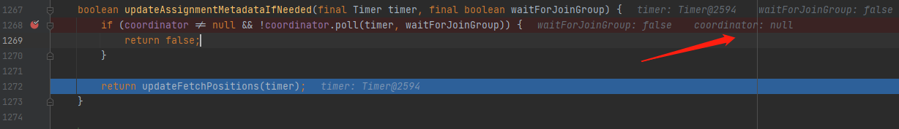

## 问题

有个需求，需要频繁seek到指定partition的指定offset，然后poll，且只poll一次，目的是为了**快速**将指定offset的消息拉取出来。

通常的poll写法是，将poll逻辑放在死循环里，第一次拉不到，第二次继续。如果offset上有消息，就一定能消费到：

```java
consumer.subscribe("topics");
while(true){
    records = consumer.poll(Duration.ofSeconds(1));
    // do something with records
}
```

但我使用的是consumer.assign()方法，而不是subscribe()。因为要灵活指定分区，用subscribe的话，触发rebalance很麻烦。代码如下：

```java
public ConsumerRecord<String, String> seekAndPoll(String topic, int partition, long offset) {
    TopicPartition tp = new TopicPartition(topic, partition);
    consumer.assign(Collections.singleton(tp));
    System.out.println("assignment:" + consumer.assignment()); // 这里是有分配到分区的
    consumer.seek(tp, offset);
    ConsumerRecords<String, String> records = consumer.poll(Duration.ofMillis(100))
    if(records.isEmpty()){
        // 大概率拉取不到消息，进入此分支
        return null;
    } else {
        return records.iterator().next();
    }
}
```

由于我只poll一次，这就要求必须一次拉到消息。从现象上看，感觉是在seek之后，kafka有些metadata更新之类的操作未执行完毕，此时poll就拉不到消息。

我在StackOverflow上也搜到了这个问题（[java - Kafka Cluster sometimes returns no records during seek and poll - Stack Overflow](https://stackoverflow.com/questions/68802558/kafka-cluster-sometimes-returns-no-records-during-seek-and-poll)），但是没有答案。在解决了这个问题后，我添加了一个答案。

## 分析

### 猜测1 新旧poll方法的区别

在测试时，发现有时使用旧版本的`poll(long timeout)`方法有效，使用新版本的`poll(Duration timeout)`方法无效。会不会跟这个有关？（调式发现无关，不感兴趣的可跳过这一节）

两个poll方法签名如下：

```java
@Deprecated
public ConsumerRecords<K, V> poll(final long timeoutMs) {
    return poll(time.timer(timeoutMs), false);
}

public ConsumerRecords<K, V> poll(final Duration timeout) {
    return poll(time.timer(timeout), true);
}
```

二者都调用了下面的这个poll方法，关键在于第二个参数`includeMetadataInTimeout`，新版为false，老版为true。

```java
private ConsumerRecords<K, V> poll(final Timer timer, final boolean includeMetadataInTimeout) {
    // 略
    if (includeMetadataInTimeout) {
        // try to update assignment metadata BUT do not need to block on the timer for join group
        updateAssignmentMetadataIfNeeded(timer, false);
    } else {
        while (!updateAssignmentMetadataIfNeeded(time.timer(Long.MAX_VALUE), true)) {
            log.warn("Still waiting for metadata");
        }
    }
    // 略
}
```

这个Boolean值最终传递给了`coordinator.poll()`的`waitForJoinGroup`。因此，关键就在于`coordinator`在poll的时候是否等待消费者成功加入消费组。

```java
boolean updateAssignmentMetadataIfNeeded(final Timer timer, final boolean waitForJoinGroup) {
    if (coordinator != null && !coordinator.poll(timer, waitForJoinGroup)) {
        return false;
    }

    return updateFetchPositions(timer);
}
```

但调试发现，在使用assign手动指定消费分区时，coordinator 为 null。这很好理解，只有subscribe模式才存在重平衡等情况，需要coordinator进行协调。



所以能否拉取到消息，与poll是新版还是旧版无关。

延伸阅读，关于poll方法改版的KIP：

> [KIP-266: Fix consumer indefinite blocking behavior](https://cwiki.apache.org/confluence/display/KAFKA/KIP-266%3A+Fix+consumer+indefinite+blocking+behavior)
>
> 关键内容摘抄如下：
>
> Consumer#poll
>
> The pre-existing variant `poll(long timeout)` would block indefinitely for metadata updates if they were needed, then it would issue a fetch and poll for `timeout` ms for new records. The initial indefinite metadata block caused applications to become stuck when the brokers became unavailable. The existence of the timeout parameter made the indefinite block especially unintuitive.
>
> We will add a new method `poll(Duration timeout)` with the semantics:
>
> 1. iff a metadata update is needed:
>
>     1. send (asynchronous) metadata requests
>     2. poll for metadata responses (counts against timeout)
>
>         * if no response within timeout, return an empty collection immediately
> 2. if there is fetch data available, return it immediately
> 3. if there is no fetch request in flight, send fetch requests
> 4. poll for fetch responses (counts against timeout)
>
>     * if no response within timeout, return an empty collection (leaving async fetch request for the next poll)
>     * if we get a response, return the response
>
> We will deprecate the original method, `poll(long timeout)`, and we will not change its semantics, so it remains:
>
> 1. iff a metadata update is needed:
>
>     1. send (asynchronous) metadata requests
>     2. poll for metadata responses *indefinitely until we get it*
> 2. if there is fetch data available, return it immediately
> 3. if there is no fetch request in flight, send fetch requests
> 4. poll for fetch responses (counts against timeout)
>
>     * if no response within timeout, return an empty collection (leaving async fetch request for the next poll)
>     * if we get a response, return the response
>
> One notable usage is prohibited by the new `poll`: previously, you could call `poll(0)` to block for metadata updates, for example to initialize the client, supposedly without fetching records. Note, though, that this behavior is not according to any contract, and there is no guarantee that `poll(0)` won't return records the first time it's called. Therefore, it has always been unsafe to ignore the response.
>

简言之，`poll(long timeout)` 是无限期阻塞的，会等待订阅的元数据信息更新完成（这个等待时间不包含在timeout之内），确保能拉到消息。而`poll(Duration timeout)`不会一直阻塞，经过最多timeout后就会返回，不管拉没拉到消息。

### 猜测2 timeout决定了一切

在调式过程中，我发现不管用用新版的poll，还是老版本的poll，当timeout太小时，如**10ms**，第一次poll多半拉不到消息；timeout足够大时，比如**2000ms**，每次都拉到消息了。于是我得出结论：将timeout设置足够大即可。不足的是，如果传入的offset参数越界，该位置本来就没有消息，poll方法也会等待timeout才返回（**这里或许是kafka的一个待优化的点？**），浪费时间，于是我决定加一个检查，当传入的offset超过partition的起始偏移量时，快速返回。代码如下：

```java
public ConsumerRecord<String, String> seekAndPoll(String topic, int partition, long offset) {
    TopicPartition tp = new TopicPartition(topic, partition);
    consumer.assign(Collections.singleton(tp));
    System.out.println("assignment:" + consumer.assignment()); // 这里是有分配到分区的
  
    // endOffset: the offset of the last successfully replicated message plus one
    // if there has 5 messages, valid offsets are [0,1,2,3,4], endOffset is 4+1=5
    Long endOffset = consumer.endOffsets(Collections.singleton(tp)).get(tp); 
    Long beginOffset = consumer.beginningOffsets(Collections.singleton(tp)).get(tp);
    if (offset < beginOffset || offset >= endOffset) {
        System.out.println("offset is illegal");
        return null;
    } else {
        consumer.seek(tp, offset);
        ConsumerRecords<String, String> records = consumer.poll(Duration.ofMillis(2000))
        if(records.isEmpty()){
            return null;
        } else {
            return records.iterator().next();
        }
    }
}
```

### 真相？ consumer.endOffsets()

我做了一个测试，在2个topic的4个partition上反复执行猜测2的代码，循环10000次，并更改timeout的大小，期望得出timeout值的大小与seekAndPoll失败之间量化关系。结果发现，即使timeout只有10ms，poll也有非常高的成功率；timeout=50ms时，poll成功率就能达到**100%**。而之前要`timeout=1000ms ~ 2000ms`才能有这么高的成功率。我反复检查，最终发现是这两行代码造成的：

```java
Long beginOffset = consumer.beginningOffsets(Collections.singleton(tp)).get(tp);
Long endOffset = consumer.endOffsets(Collections.singleton(tp)).get(tp); 
```

点进`endOffsets`方法浏览了一下，底下大概做了`fetchOffsetsByTimes`、`awaitMetadataUpdate`等事情。但是consumer.endOffsets()方法也不是万无一失的，当timeout=5ms时，poll成功率为97%。

测试代码见文末。

## 结论

就按照上述猜测2的代码写，timeout设置为2000ms或者更大。只要seek传入的offset通过了检查，那么该offset上一定有消息，poll时就会立即返回。因此这个timeout即使设置很大也无影响。

`consumer.beginOffsets()`和`consumer.endOffsets()`一方面起到了检查offset的作用，另一方面起到了降低timeout的作用（虽然这并不是目的）。

注意，在beginOffset和endOffset确定的情况下进行多次seek，不需要每次都调API去查询，而是应该缓存起来多次使用。在这种情况下，能一次poll到消息就靠timeout了，因此，不要把timeout设置得太小，至少100ms。

## 测试代码

[kafka-test/SeekTest.java at main · whuwangyong/kafka-test (github.com)](https://github.com/whuwangyong/kafka-test/blob/main/kafka-clients/src/main/java/cn/whu/wy/kafka/test/clients/seek/SeekTest.java)

<br />
