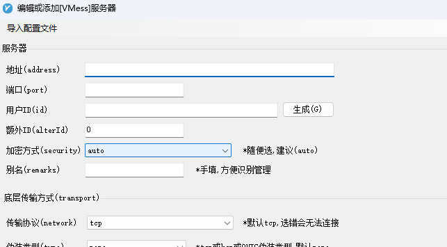
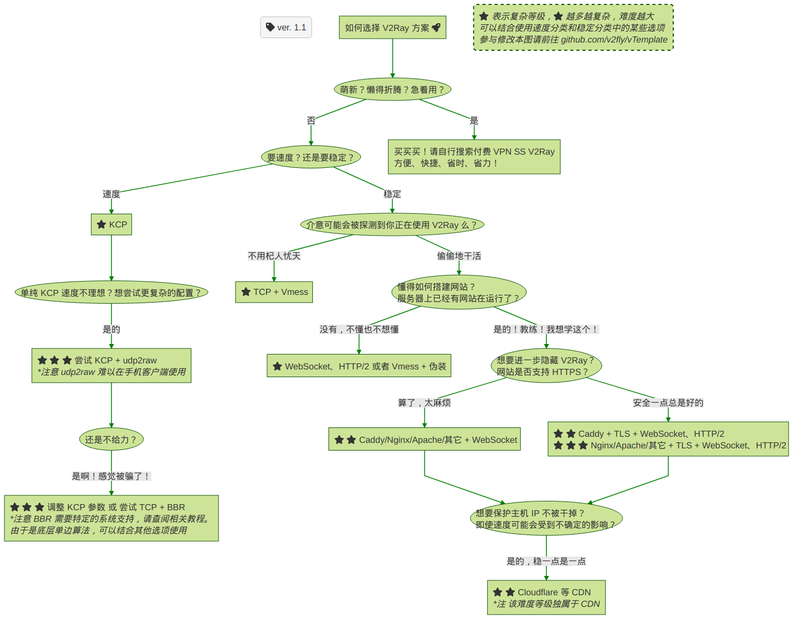

> 所有的教程都不如官网。
>


## 官网

官网：[V2Fly.org](https://www.v2fly.org/)

github：[v2fly/v2ray-core: A platform for building proxies to bypass network restrictions. (github.com)](https://github.com/v2fly/v2ray-core)

> 以下是旧的官网和github：
>
> * 官网：[Project V · Project V 官方网站 (v2ray.com)](https://www.v2ray.com/)
> * github：[v2ray/v2ray-core: A platform for building proxies to bypass network restrictions. (github.com)](https://github.com/v2ray/v2ray-core)
>
> 注意，旧版本的安装脚本已废弃。
>


## 安装

使用Linux安装脚本：

[v2fly/fhs-install-v2ray: Bash script for installing V2Ray in Linux that support systemd (github.com)](https://github.com/v2fly/fhs-install-v2ray)

> 该脚本在运行时会提供 `info` 和 `error` 等信息，请仔细阅读。
>
> ### 安装和更新 V2Ray
>
> ```
> // 安装可执行文件和 .dat 数据文件
> # bash <(curl -L https://raw.githubusercontent.com/v2fly/fhs-install-v2ray/master/install-release.sh)
> ```
>
> ### 安装最新发行的 geoip.dat 和 geosite.dat
>
> ```
> // 只更新 .dat 数据文件
> # bash <(curl -L https://raw.githubusercontent.com/v2fly/fhs-install-v2ray/master/install-dat-release.sh)
> ```
>
> ### 移除 V2Ray
>
> ```
> # bash <(curl -L https://raw.githubusercontent.com/v2fly/fhs-install-v2ray/master/install-release.sh) --remove
> ```
>


我的安装日志：

```shell
# 先切换到root
$ sudo su
# 执行
root@ubuntu:~# bash <(curl -L https://raw.githubusercontent.com/v2fly/fhs-install-v2ray/master/install-release.sh)
  % Total    % Received % Xferd  Average Speed   Time    Time     Time  Current
                                 Dload  Upload   Total   Spent    Left  Speed
100 21647  100 21647    0     0  1321k      0 --:--:-- --:--:-- --:--:-- 1321k
info: Installing V2Ray v4.44.0 for aarch64
Downloading V2Ray archive: https://github.com/v2fly/v2ray-core/releases/download/v4.44.0/v2ray-linux-arm64-v8a.zip
  % Total    % Received % Xferd  Average Speed   Time    Time     Time  Current
                                 Dload  Upload   Total   Spent    Left  Speed
100   664  100   664    0     0   2055      0 --:--:-- --:--:-- --:--:--  2055
100 12.4M  100 12.4M    0     0  3138k      0  0:00:04  0:00:04 --:--:-- 4019k
Downloading verification file for V2Ray archive: https://github.com/v2fly/v2ray-core/releases/download/v4.44.0/v2ray-linux-arm64-v8a.zip.dgst
info: Extract the V2Ray package to /tmp/tmp.A891dl5AVC and prepare it for installation.
info: Systemd service files have been installed successfully!
warning: The following are the actual parameters for the v2ray service startup.
warning: Please make sure the configuration file path is correctly set.
# /etc/systemd/system/v2ray.service
[Unit]
Description=V2Ray Service
Documentation=https://www.v2fly.org/
After=network.target nss-lookup.target

[Service]
User=nobody
CapabilityBoundingSet=CAP_NET_ADMIN CAP_NET_BIND_SERVICE
AmbientCapabilities=CAP_NET_ADMIN CAP_NET_BIND_SERVICE
NoNewPrivileges=true
ExecStart=/usr/local/bin/v2ray -config /usr/local/etc/v2ray/config.json
Restart=on-failure
RestartPreventExitStatus=23

[Install]
WantedBy=multi-user.target

# /etc/systemd/system/v2ray.service.d/10-donot_touch_single_conf.conf
# In case you have a good reason to do so, duplicate this file in the same directory and make your customizes there.
# Or all changes you made will be lost!  # Refer: https://www.freedesktop.org/software/systemd/man/systemd.unit.html
[Service]
ExecStart=
ExecStart=/usr/local/bin/v2ray -config /usr/local/etc/v2ray/config.json

installed: /usr/local/bin/v2ray
installed: /usr/local/bin/v2ctl
installed: /usr/local/share/v2ray/geoip.dat
installed: /usr/local/share/v2ray/geosite.dat
installed: /usr/local/etc/v2ray/config.json
installed: /var/log/v2ray/
installed: /var/log/v2ray/access.log
installed: /var/log/v2ray/error.log
installed: /etc/systemd/system/v2ray.service
installed: /etc/systemd/system/v2ray@.service
removed: /tmp/tmp.A891dl5AVC
info: V2Ray v4.44.0 is installed.
You may need to execute a command to remove dependent software: apt purge curl unzip
Please execute the command: systemctl enable v2ray; systemctl start v2ray
root@instance-20220307-2119:/home/ubuntu/v2ray# systemctl status v2ray 
● v2ray.service - V2Ray Service
     Loaded: loaded (/etc/systemd/system/v2ray.service; disabled; vendor preset: enabled)
    Drop-In: /etc/systemd/system/v2ray.service.d
             └─10-donot_touch_single_conf.conf
     Active: inactive (dead)
       Docs: https://www.v2fly.org/
```

## 配置

官方给了模板：[v2fly/v2ray-examples: v2ray-core 的模板们 (github.com)](https://github.com/v2fly/v2ray-examples)

如果想了解更多，还有一份详细文档：[V2Ray 配置指南 | 新 V2Ray 白话文指南 (v2fly.org)](https://guide.v2fly.org/)

### 一份简单的配置

来源：[VMess | 新 V2Ray 白话文指南 (v2fly.org)](https://guide.v2fly.org/basics/vmess.html)

#### 服务端配置
配置文件位于`/usr/local/etc/v2ray/config.json`

```json
{
  "inbounds": [
    {
      "port": 16823, // 服务器监听端口
      "protocol": "vmess",    // 主传入协议
      "settings": {
        "clients": [
          {
            "id": "b831381d-6324-4d53-ad4f-8cda48b30811",  // 用户 ID，客户端与服务器必须相同
            "alterId": 0 // 新版本不能设置为64

          }
        ]
      }
    }
  ],
  "outbounds": [
    {
      "protocol": "freedom",  // 主传出协议
      "settings": {}
    }
  ]
}
```

#### 客户端配置
例如，在Windows上使用v2rayN，服务器->添加VMess服务器，可以手动填写各项，也可以导入配置文件。

```json
{
  "inbounds": [
    {
      "port": 1080, // 监听端口
      "protocol": "socks", // 入口协议为 SOCKS 5
      "sniffing": {
        "enabled": true,
        "destOverride": ["http", "tls"]
      },
      "settings": {
        "auth": "noauth"  //socks的认证设置，noauth 代表不认证，由于 socks 通常在客户端使用，所以这里不认证
      }
    }
  ],
  "outbounds": [
    {
      "protocol": "vmess", // 出口协议
      "settings": {
        "vnext": [
          {
            "address": "serveraddr.com", // 服务器地址，请修改为你自己的服务器 IP 或域名
            "port": 16823,  // 服务器端口
            "users": [
              {
                "id": "b831381d-6324-4d53-ad4f-8cda48b30811",  // 用户 ID，必须与服务器端配置相同
                "alterId": 0 // 此处的值也应当与服务器相同
              }
            ]
          }
        ]
      }
    }
  ]
}
```

### 如何生成 UUID

在线生成器：[Online UUID Generator Tool](https://www.uuidgenerator.net/)

Linux 命令生成：`cat /proc/sys/kernel/random/uuid` 

> **版本**
>
> 对于“变体（variants）1”和“变体2”，标准中定义了五个版本（versions），并且在特定用例中每个版本可能比其他版本更合适。
>
> 版本由 M 字符串中指示。
>
> 版本1 - UUID 是根据时间和 节点ID（通常是MAC地址）生成；
>
> 版本2 - UUID是根据标识符（通常是组或用户ID）、时间和节点ID生成；
>
> 版本3、版本5 - 确定性UUID 通过散列（hashing）名字空间（namespace）标识符和名称生成；
>
> 版本4 - UUID 使用[随机性](https://zh.wikipedia.org/wiki/%E9%9A%8F%E6%9C%BA%E6%80%A7 "随机性")或[伪随机性](https://zh.wikipedia.org/wiki/%E4%BC%AA%E9%9A%8F%E6%9C%BA%E6%80%A7 "伪随机性")生成。
>
> —— 来源：[通用唯一识别码 - 维基百科，自由的百科全书 (wikipedia.org)](https://zh.wikipedia.org/wiki/%E9%80%9A%E7%94%A8%E5%94%AF%E4%B8%80%E8%AF%86%E5%88%AB%E7%A0%81#%E7%89%88%E6%9C%AC)
>

### 如何选择配置方案

官方的这个图真的太皮了，特意拿过来：




## 运行

```shell
sudo systemctl start v2ray
```

开机自启：

```shell
sudo systemctl enable v2ray.service
Created symlink /etc/systemd/system/multi-user.target.wants/v2ray.service → /etc/systemd/system/v2ray.service.
```


