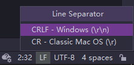
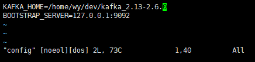
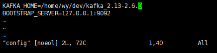

## 问题描述

有一个配置文件 config：

```bash
KAFKA_HOME=/home/wy/dev/kafka_2.13-2.6.0
BOOTSTRAP_SERVER=127.0.0.1:9092
```

另有一个使用该配置文件的脚本 list-topics.sh：

```bash
#!/bin/bash
. config

"$KAFKA_HOME"/bin/kafka-topics.sh --bootstrap-server "$BOOTSTRAP_SERVER" --list
```

我使用虚拟机Ubuntu挂载Windows分区，执行在Windows环境下编写的脚本，提示：

```bash
wy@ship:/mnt/hgfs/D/projects/kafka-mate/scripts$ ./list-topics.sh 
/bin/kafka-topics.sh: No such file or directory13-2.6.0
```

## 解决

找了好久的原因，最终注意到config文件的换行符编码为`CRLF`。

> 三种换行符（line separator）：
>
> * Windows：CRLF(`\r\n`)
> * Unix and macOSLinux：LF(`\n`)
> * CLassic Mac OS：CR(`\r`)，少见
>

改为`LF`后，脚本运行正常。我用的IDEA，在右下角更改：



## vim状态栏的[noeol] [dos]是什么意思？

当config的line separator问`CRLF`时，vim打开Windows分区上的文件时，状态栏显示`[noeol][dos]`：



当config的line separator问`LF`时，vim打开Windows分区上的文件时，状态栏显示`[noeol]`：



noeol：no end of line。

如果是Linux分区上的文件，且line separator为`LF`时，状态栏不会额外显示。

以下内容来自：[Vim 编辑器底端 [noeol], [dos] 的含义 - Trekshot - 博客园 (cnblogs.com)](https://www.cnblogs.com/Trekshot/archive/2012/11/26/the-meaning-of-noeol-and-dos-flag-in-vim.html)

有时使用 Vim 打开一个文件会在窗口底部发现 [noeol], [dos] 提示信息：

```
"hello-dos.txt" [noeol][dos] 2L, 10C                          1,1           All
```

这两个符号有何含义？

直观上理解，'noeol' 就是 'no end-of-line', 即“没有行末结束符”， Linux 下的文本编辑器（如 Vim）会在每一行 （包括最后一行）末尾添加一个换行符。比如我们在 Debian 下新建一个名为 'hello-unix.txt' 的文本文件，内容如下：

```
Hello
Unix
```

那么，使用`cat -A hello-unix.txt`命令可以看到这些换行符：

```
ts@TS:~/www/document$ cat -A hello-unix.txt
Hello$
Unix$
ts@TS:~/www/document$
```

从中可以清楚地看到每行末尾的 '`$`' 字符，这就是 Linux 下的“行末结束符”。

下面我们再在 Windows 下创建一个名为 'hello-dos.txt' 记事本文件，内容如下：

```
Hello
DOS
```

在 Debian 下查看此文件的换行符信息：

```
ts@TS:~/www/document$ cat -A hello-dos.txt
Hello^M$
DOSts@TS:~/www/document$
```

同样是两行，每行一个单词，Windows 和 Linux 下的换行符有两个明显不同：

1. Windows 下的换行符比 Linux 下的多了个 `^M`；
2. 最后一行行末没有换行符；

这两个不同之处也正是 [dos], [noeol] 两个 Flag 信息出现的原因。 Windows 下文本文件每行的换行符为“回车+换行”(`CRLF,^M$`), 而 Linux 下则仅为 “换行” (`LF, $`). Vim 发现文本中含有 `^M$`换行字符判定为 Windows 下创建的 文件，用 [dos] Flag 提示；Vim 没有在最后一行发现换行符，判定此文件不是在 Linux 下创建/编辑，用 [noeol] Flag 提示用户。

### 如何消除 [noeol] Flag？

只需在 Debian 下将该文件重新保存即可，还是上面的 hello-dos.txt 文件，打开它， 不做任何修改直接 `:wq`保存退出，再查看换行符：

```
ts@TS:~/www/document$ cat -A hello-dos.txt
Hello^M$
DOS^M$
ts@TS:~/www/document$
```

换行符已经追加上去，这里要注意的是追加的是 Windows 下的换行符（回车+换行） `^M$`, 而不是 Linux 下的换行符（换行）`$`, 因为 Vim 已经发现此文件是在 Windows 下创建的（[dos] Flag），尽管是在 Linux 下编辑，Vim 也会按照文件创建时所在的操作系统下的换行规则添加换行符。

### 如何消除 [dos] Flag？

有两种简单的方法：

1. Linux 下提供有两个命令用来进行 Windows 和 Unix 文件的转化：`dos2unix `和 `unix2dos`;
2. 在 Debian 下使用 touch template.txt 创建一个模板，在 Windows 下创建的任 何文本文件都以此模板为基础；

## Reference

[Vim 编辑器底端 [noeol], [dos] 的含义 - Trekshot - 博客园 (cnblogs.com)](https://www.cnblogs.com/Trekshot/archive/2012/11/26/the-meaning-of-noeol-and-dos-flag-in-vim.html)


