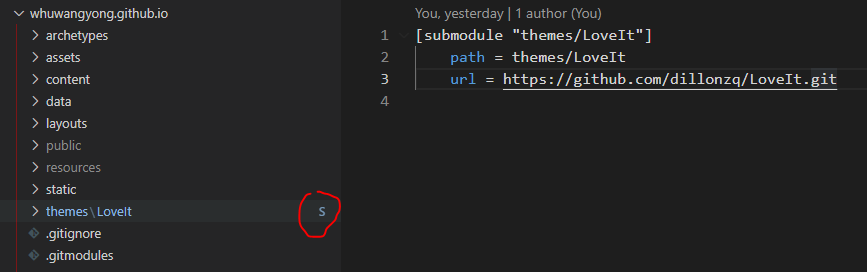

最近学习使用 [Hugo](https://gohugo.io/) 构建静态网站。安装主题时，接触到`git submodule`这个命令，踩了些坑，总结一下。

## 子模块与父模块如何同步更新

子模块是一个单独的项目，`commit push`等操作需要在子模块自己的repo目录下操作。父项目的操作与子模块无关。父项目`git add`无法添加子模块的`changes`，当然也就无法`commit push`。

子模块版本升级后，父项目不会自动升级，仍然停留在对之前版本的引用。以下命令可以查看父模块当前使用子模块的哪个版本：

```bash
> git submodule status
f0dc1cf84d7c47dc1625e956f07b37b6c238a3dc themes/hugo-theme-stack (v3.8.0-4-gf0dc1cf)
```

子模块修改后，父模块虽然无法`git add/commit/push`，但是`git status`却可以显示：

```bash
> git status
On branch master
Your branch is up to date with 'origin/master'.

Changes not staged for commit:
(use "git add ..." to update what will be committed)
(use "git restore ..." to discard changes in working directory)
modified:   themes/hugo-theme-stack (new commits)
```

这里会让人疑惑，有changes，但是无法add进来。

这是因为，子模块的修改，只能在子模块里面进行`commit & push`。

子模块`commit & push`之后，父模块不会自动更新，仍然保持着对子模块上一版本的引用。此时可以使用`git add submoduleDir` 添加子模块的更新，然后`commit & push`，将子模块的修改同步到父模块。

如果父模块在尚未`add & commit & push`子模块更新的情况下，执行了`git submoule update`，此时子模块会回滚到上一版本（父模块引用的那个版本）。然后去子模块`git status`，会提示 `HEAD detached at xxxxxx`。

如果发生了上述情况，可以在子模块`git branch -a`查看分支，`git checkout`到上次提交修改的分支。然后子模块就恢复到`working tree clean`了。

再去父模块，`git add submoduleDir && commit && push`。

## 无法拉取submodule代码到本地

git clone 了一个包含submodule的仓库，打开submodule目录，发现里面是空的：



可尝试以下命令：

```bash
git submodule update
git submodule update --recursive --remote
git submodule update --init
```

## fatal: could not get a repository handle for submodule xxx

这是很常见的错误。当上次 clone into 未完成就直接关闭，下次 git submodule update 就会报这个错。

```bash
$ git submodule update --init
Cloning into 'D:/blog/whuwangyong.github.io/themes/FixIt'...
^C

$ git submodule update
BUG: submodule considered for cloning, doesn't need cloning any more?
fatal: could not get a repository handle for submodule 'themes/FixIt'
```

解决办法：将 submodule 路径下的`.git`文件删掉即可。

## 如何修改子模块的 remote url

需求：使用的别人的主题repo作为子模块。然后改了些地方，发现无法提交到父项目，更不能提交到别人的repo。

解决：fork别人的repo，然后使用自己fork的repo作为子模块。后面原作者的repo更新了，再单独升级fork后的repo。升级时注意别覆盖了自己的修改。如果使用良好，不升级也可。

那么，如何将submodule，从引用别人的repo，改为引用自己的。

### 先删除

> GIT 未提供submodule remove的功能。要删除一个子模块，需按照下面步骤操作：
>
> 1. git submodule deinit sub/module，执行后模块目录将被清空。
> 2. git rm sub/module，执行后会清除.gitmodules里的项目。
> 3. git commit -m ‘remove sub/module。
>
> 第一步不做似乎也没关系。第二步是关键，这里不能直接rm sub/module，这样不会同步更新.gitmodules的内容。
>

### 再添加

```bash
git submodule add https://github.com/whuwangyong/hugo-theme-stack/ themes/hugo-theme-stack
```

如果遇到如下错误：

> A git directory for ‘hugo-theme-stack’ is found locally with remote(s): origin [https://github.com/CaiJimmy/hugo-theme-stack/](https://github.com/CaiJimmy/hugo-theme-stack/) If you want to reuse this local git directory instead of cloning again from [https://github.com/CaiJimmy/hugo-theme-stack/](https://github.com/CaiJimmy/hugo-theme-stack/) use the ‘–force’ option. If the local git directory is not the correct repo or you are unsure what this means choose another name with the ‘–name’ option.
>

需删除本地的缓存：

```bash
git rm --cached sub/module 
```

或直接删除站点根目录的`.git/module/`下面对应的子模块：

```bash
rm -rf .git/module/hugo-theme-stack
```

然后再次执行`git submodule add`。

## Reference

1. [GIT 的 SUBMODULE - 阅微堂 (zhiqiang.org)](https://zhiqiang.org/it/git-submodule.html)
2. [git submodule删除后重新添加问题_Week Mao的专栏-CSDN博客](https://blog.csdn.net/dongguanghuiyin/article/details/78792992)
3. [来说说坑爹的 git submodule - 掘金 (juejin.cn)](https://juejin.cn/post/6844903920645455879)
4. [Git Submodule_弹吉他的小刘鸭的博客-CSDN博客](https://blog.csdn.net/alexhu2010q/article/details/109239897)


