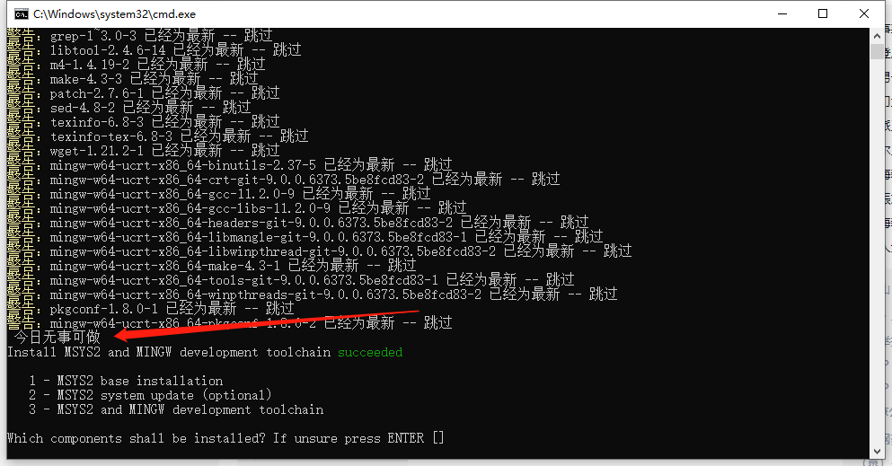
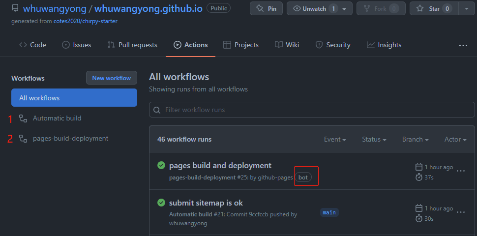
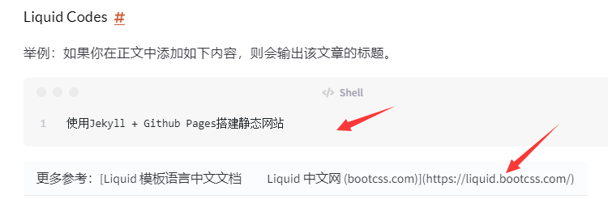
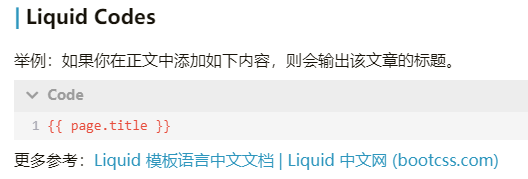

Jekyll 是 Github Pages 官方支持的静态网站生成工具，优点是在可以直接github上使用vscode online编辑md，提交后，github会承担生成html的工作。而使用hugo等工具，需要先在本地将md文件渲染成html，然后上传。

> **提示**
>
> 1. hugo的优点是快！
> 2. 虽然github pages只支持渲染Jekyll，但是netlify、vercel等平台支持渲染hugo、jekyll等更多框架。
>

## 主题选择

看了几个jekyll主题，发现 [Chirpy](https://github.com/cotes2020/jekyll-theme-chirpy) 最得我心。在[jekyll-template · GitHub Topics](https://github.com/topics/jekyll-template)下，Chirpy主题排名第二。

本文记录Jekyll和chirpy的搭配使用。

## 安装Ruby和Jekyll

前面说了github可以编译Jekyll，为什么还要在本地装一套环境呢。主要是为了方便调试，尤其是刚开始配置主题的时候。

比起Hugo来说，jekyll的安装要麻烦一些，需要安装的东西一大堆：

> Follow the instructions in the [Jekyll Docs](https://jekyllrb.com/docs/installation/) to complete the installation of `Ruby`, `RubyGems`, `Jekyll`, and `Bundler`.
>

1. Download and install a **Ruby+Devkit** version from [RubyInstaller Downloads](https://rubyinstaller.org/downloads/). Use default options for installation.
2. Run the `ridk install` step on the last stage of the installation wizard. This is needed for installing gems with native extensions. You can find additional information regarding this in the [RubyInstaller Documentation](https://github.com/oneclick/rubyinstaller2#using-the-installer-on-a-target-system)

    > 第一次接触ruby，完全懵逼，不知道装了些啥，接近1个GB。打印的日志是清新脱俗。
    >
    > 
    >
3. Open a new command prompt window from the start menu, so that changes to the `PATH` environment variable becomes effective. Install Jekyll and Bundler using `gem install jekyll bundler`
4. Check if Jekyll has been installed properly: `jekyll -v`

到这里，本地环境就安装好了。

## Chirpy主题的使用

### Install

#### Creating a New Site

跟着[这里](https://chirpy.cotes.page/posts/getting-started/#installation)操作。简言之，使用其提供的 template repo 创建自己的 repo，命名为`<GH_USERNAME>.github.io`。

#### Installing Dependencies

将创建的 repo（<GH_USERNAME>.github.io） clone 到本地，执行：

```plaintext
git clone git@github.com:<GH_USERNAME>/<GH_USERNAME>.github.io
cd <GH_USERNAME>.github.io
bundle
```

依赖安装完后，生成一个`Gemfile.lock`文件。

> <GH_USERNAME>.github.io里面有一个Gemfile文件，它指定了你想要使用的gem的位置和版本。
>
> bundle命令根据Gemfile文件安装依赖，并将安装的每个依赖的版本，记录在Gemfile.lock文件里。这样，当相同的库或是项目在另一台机器上加载时，运行bundle install将安装完全相同的版本，而不是最新的版本。(在不同的机器上运行不同的版本可能会导致测试失败等等)。简单来说就是保证在不同环境下gem版本相同。
>

`Gemfile.lock`文件可以提交到github，让github pages的deploy 脚本也使用相同的版本。但是，由于我是在Windows上运行`bundle`的，github pages的部署环境是linux。因此，需要运行以下命令，将 x86_64-linux 平台的一些库添加到`Gemfile.lock`里面（只有几个，多数是跨平台兼容的）：

```plaintext
bundle lock --add-platform x86_64-linux
```

### Configuration

主要就是修改如下几个文件：

#### _config.yml

```yaml
timezone: Asia/Shanghai
google_site_verification: googledxxxxxxx.html # 去Google Search Console申请，用于google收录
avatar: assets/img/avatar/wy-avatar-339x335.jpg # 头像
comments:
  active: utterances # 使用github issue作为文章的评论系统
  utterances:
    repo: whuwangyong/whuwangyong.github.io        # <gh-username>/<repo>
    issue_term: title  # < url | pathname | title | ...>
paginate: 20
```

#### _tabs/about.md

自定义“关于我”的内容。  

#### favicon

自定义网站图标。将favicon.ico文件放入`assets/img/favicons/`。[Customize the Favicon - Chirpy (cotes.page)](https://chirpy.cotes.page/posts/customize-the-favicon/)

#### _data/share.yml

配置文章的分享选项，如Facebook、微博之类的。

### Writing a New Post

[Writing a New Post | Chirpy (cotes.page)](https://chirpy.cotes.page/posts/write-a-new-post/)

* 在`_posts`目录下创建`YYYY-MM-DD-TITLE.md`文件即可，**必须按照此格式命名**。可以使用子目录，用于分类
* 图片必须放在`/assets/`下。最佳实践：放在`/assets/img/posts/[YYYY-MM-DD-TITLE]`目录下

#### Front Matter

```yaml
---
title: TITLE
date: YYYY-MM-DD HH:MM:SS +/-TTTT # 2022-01-01 13:14:15 +0800 只写日期也行；不写秒也行；这样也行 2022-03-09T00:55:42+08:00
categories: [TOP_CATEGORIE, SUB_CATEGORIE]
tags: [TAG]     # TAG names should always be lowercase

author: # 不写默认就是自己
  name: Full Name
  link: https://example.com

# 以下默认false
math: true
mermaid: true
pin: true
---
```

#### 分类

支持多层级。如`categories: [Java, Spring, AOP]`，最终的分类效果是`Java/Spring/AOP`，这样就可以复用笔记软件里面设置好的分类。

#### 标签

该主题的作者建议，**TAG names should always be lowercase**。我猜测这么做的原因是，大小写混用会导致相同含义的标签以多种形式出现，如：VSCode、VScode、vscode。学到了。在我的笔记软件里面，大小写混用的标签正让我苦不堪言。

#### img_path

当文中很多图片具备共同的前缀时，可以将该前缀提取出来，放在[Front Matter](https://jekyllrb.com/docs/front-matter/)。

#### Liquid Codes

举例：如果你在正文中添加如下内容，则会输出该文章的标题。

```plaintext
{{ page.title }}
```

更多参考：[Liquid 模板语言中文文档 | Liquid 中文网 (bootcss.com)](https://liquid.bootcss.com/)

### Running Local Server

You may want to preview the site contents before publishing, so just run it by:

```bash
bundle exec jekyll s # serve, server, s      Serve your site locally

# 编译命令是
bundle exec jekyll b # build, b              Build your site
```

After a while, the local service will be published at  *[http://127.0.0.1:4000](http://127.0.0.1:4000/)* .

### Deployment

Deploy by Using Github Actions。直接提交到github即可。

### Upgrading

如前文所述，依赖的库及其版本都指定在`Gemfile` 里面，因此，修改此文件，更新`jekyll-theme-chirpy`的版本号即可：

```diff
- gem "jekyll-theme-chirpy", "~> 3.2", ">= 3.2.1"
+ gem "jekyll-theme-chirpy", "~> 3.3", ">= 3.3.0"
```

And then execute the following command:

```plaintext
bundle update jekyll-theme-chirpy
```

As the version upgrades, the critical files (for details, see the [Startup Template](https://github.com/cotes2020/chirpy-starter)) and configuration options will change. Please refer to the [Upgrade Guide](https://github.com/cotes2020/jekyll-theme-chirpy/wiki/Upgrade-Guide) to keep your repo’s files in sync with the latest version of the theme.

### 发布时间与更新时间

chirpy主题还有个优点：自带文章的更新时间。  
​  
这就不需要倒腾额外的jekyll插件去实现这个功能了。如[gjtorikian/jekyll-last-modified-at: A Jekyll plugin to show the last_modified_at time of a post. (github.com)](https://github.com/gjtorikian/jekyll-last-modified-at)

### 添加tab到左侧栏

如新增“友情链接”tab。在`_tabs`目录下新建`links.md`:

```plaintext
---
title: 友情链接
icon: fas fa-link
order: 5
---
```

调整order和icon。icon去[Font Awesome Icons](http://www.fontawesome.com.cn/)里面找。然后修改`_data/locales/en.yml`和`_data/locales/zh-CN.yml`，在`tabs:`下添加`links: Links`和`links: 友链`，以适配中英文。

## 进阶内容

用了两天，对Jekyll + Github Pages 的工作逻辑有了一些理解。

### 为什么使用Jekyll可以直接提交md

在`<github_username>.github.io`根目录下，查看`.github/workflows/pages-deploy.yml`文件：<br />

```yaml
name: 'Automatic build'
on:
  push:
    branches:
      - main
    paths-ignore:
      - .gitignore
      - README.md
      - LICENSE

jobs:
  continuous-delivery:

    runs-on: ubuntu-latest

    steps:
      - name: Checkout
        uses: actions/checkout@v2
        with:
          fetch-depth: 0  # for posts's lastmod

      - name: Setup Ruby
        uses: ruby/setup-ruby@v1
        with:
          ruby-version: 2.7
          bundler-cache: true

      - name: Deploy
        run: bash tools/deploy.sh
```

该文件定义了一个workflow：当push代码到main分支时，执行jobs里面定义的动作。最关键的是`Deploy`这一步，它执行了一个脚本：`tools/deploy.sh`。这个脚本做的事情，就是执行`bundle exec jekyll build -d _site`将md文件编译为html，生成静态网站，然后将`_site`下的内容push到`gh-pages`分支。到这里就很清楚了，是github帮助我们执行了build操作，将md转换成了html。

在github上查看你的github.io项目，在Actions下面可以看到每次提交新文章时触发的workflows：  
​  
第一个workflow就是上面提到的`.github/workflows/pages-deploy.yml`，第二个是github pages创建的，可以看到`bot`标志。点进workflow runs，可以看到执行的日志，根据日志能更加清楚的知道背后的流程。

> 如果使用hugo建站，github后台并没有hugo的环境，所以不能帮助我们编译md。这就需要我们自己编译好html，然后push到github.io项目。push之后的流程是一样的：由github pages的bot将编译好的静态网站发布到`https://<username>.github.io`。
>

### 自定义workflow

* [X] 修改`tools/deploy.sh`，在里面加入自己的操作。如：将sitemap提交到百度资源平台。
* [ ] 在tools目录下新建脚本，然后在.github/workflows/pages-deploy.yml里面调用
* [ ] 在.github/workflows/下创建新的workflow

第一个亲测可行，后两个还没研究。

### 提交到谷歌/百度等搜索引擎

修改`tools/deploy.sh`，在里面新增一个函数：在deploy之后，根据生成的 sitemap.xml 创建一个包含所有url的sitemap.txt文件。将该文件提交到[百度资源平台](https://ziyuan.baidu.com/site/index)。但是GitHub封了百度的爬虫，可以考虑在vercel上也部署一份，让百度去爬vercel。另一种方法是使用反向代理，让百度爬自己的主机，自己的主机去连接github。  
至于google和bing，访问 [Google Search Console](https://search.google.com/search-console/about) 和 [Bing Webmaster Tools](https://www.bing.com/webmasters/home) 进行设置，添加博客地址之后就等着爬虫光临。  
搜狗也可以试一试，GitHub没封搜狗。

```bash
# file_name: tools/deploy.sh
# 新增 submit_sitemap 函数，在 deploy 之后调用
submit_sitemap() {
  echo "------ >>> submit_sitemap ---------"
  grep "<loc>" sitemap.xml | grep -v 'html' | awk -F '[< >]' '{print $3}' > sitemap.txt
  curl -H 'Content-Type:text/plain' --data-binary @sitemap.txt "http://data.zz.baidu.com/urls?site=https://whuwangyong.github.io&token=5os4wCK5ct7kBZRN"
  curl -H 'Content-Type:text/plain' --data-binary @sitemap.txt "http://data.zz.baidu.com/urls?site=https://whuwangyong.vercel.app&token=5os4wCK5ct7kBZRN"
  rm -f sitemap.txt
  echo "------ submit_sitemap <<< ---------"
}

main() {
  init
  build
  # ...
  deploy
  submit_sitemap
}
```

### netlify、vercel是什么

除了github pages，还有[netlify](https://www.netlify.com/)、[vercel](https://vercel.com/)等也能生成并部署静态网站。它们从`<username>.github.io` 的main分支拉取md源文件，然后在自己的资源上运行`bundle jekyll exec build`，将build之后的html放在它们自己的服务器上，并提供一个域名供你访问这个静态站点。  
除了Jekyll，它们还支持Hugo、Hexo、Next.js等多种静态网站构建工具。也就是说，只将github作为一个代码托管平台，里面可以放Jekyll、Hugo等多种构建工具和md文件，netlify和vercel都可以将它们编译为html并发布出去。从这个方面说，它们比github强大。

### Jekyll的Markdown处理器

Jekyll默认的Markdown Processor是[kramdown](https://kramdown.gettalong.org/)，这与我们常使用的typora、vscode的md解析器不同。kramdown会将pipe字符`|`解析为table语法。如果正文中有link或者image语法，且文本包含了`|`字符，需要对其进行转义。下述这种写在代码块里面可以，如果写在正文，就会当成表格了。

```markdown
[A | B](http://foo.com)
[img | 1](http://img.com/1.jpg)
```

这个问题2014年就有人提了，但是作者一直没修复：

1. [Pipes inside image alt text lead to unwanted table output · Issue #135 · gettalong/kramdown (github.com)](https://github.com/gettalong/kramdown/issues/135)
2. [the conditional probability equation doesn't display normal · Issue #46 · gettalong/kramdown (github.com)](https://github.com/gettalong/kramdown/issues/46)
3. [Kramdown bug - pipe character in Markdown link creates a table · Issue #2818 · jekyll/jekyll (github.com)](https://github.com/jekyll/jekyll/issues/2818)
4. [markdown - How do you disable tables in Kramdown? - Stack Overflow](https://stackoverflow.com/questions/23751917/how-do-you-disable-tables-in-kramdown)
5. [对 Markdown 渲染引擎 kramdown 的几点 hack | 明无梦 (dreamxu.com)](https://www.dreamxu.com/hack-markdown-converter-kramdown/)
6. [Table syntax · Issue #151 · gettalong/kramdown (github.com)](https://github.com/gettalong/kramdown/issues/151)
7. [Pipe characters in text creates table · Issue #317 · gettalong/kramdown (github.com)](https://github.com/gettalong/kramdown/issues/317)
8. [Bug - pipe character in Markdown link creates a table · Issue #431 · gettalong/kramdown (github.com)](https://github.com/gettalong/kramdown/issues/431) 这是2017年的issue，作者回复说2.x版本会修复，但仍然存在。在[kramdown - syntax](https://kramdown.gettalong.org/syntax.html)页面，搜索“Automatic and Manual Escaping”可以查看kramdown所有（可能）需要转义的字符。

所以，如果要继续用kramdown，要么禁用table语法，要么把所有用到`|`的地方全部转义。这两个我都不会选：不用table不可能；为了适应kramdown修改标准的md语法更不可能。

除了`|`字符，`<>`、liquid cldoe语法（`{{}}`）等也需要转义：






总之要注意的地方挺多，不能毫无顾忌地写markdown。

### 更改Jekyll的markdown处理器

鉴于kramdown的上述问题，我尝试给Jekyll换一个Markdown处理器。根据文档[Markdown Options - Jekyll](https://jekyllrb.com/docs/configuration/markdown/#commonmark)，除了kramdown，Jekyll还支持[jekyll-commonmark](https://github.com/jekyll/jekyll-commonmark)和[jekyll-commonmark-ghpages](https://github.com/github/jekyll-commonmark-ghpages)。我分别试用了这两个处理器，问题更多。尤其是[jekyll-commonmark-ghpages](https://rubygems.org/gems/jekyll-commonmark-ghpages)，其兼容的jekyll版本是3.9.x，与我使用的Chirpy主题（需要jekyll 4.x）不兼容。jekyll-commonmark倒是解决了`|`的问题，但是代码高亮有问题，有些代码始终无法渲染，花了整整一天翻遍了github也没找到jekyll-commonmark到底应该怎么配置。不负责任的说一句，这就是个坑。

Jekyll也支持自定义处理器，我没尝试。另一个优质主题[jekyll-TeXt-theme](https://github.com/kitian616/jekyll-TeXt-theme)同样用的kramdown。看来用Jekyll就避免不了kramdown。

### 搜索功能

Chirpy主题的作者在[这里](https://github.com/cotes2020/jekyll-theme-chirpy/issues/458#issuecomment-986226611)提到，他使用的是[Simple-Jekyll-Search](https://github.com/christian-fei/Simple-Jekyll-Search)实现的搜索功能。效果不错，速度飞快。

### 显示阅读量

使用Google Page Views： [Enable Google Page Views | Chirpy (cotes.page)](https://chirpy.cotes.page/posts/enable-google-pv/)

## Reference

1. [Getting Started | Chirpy (cotes.page)](https://chirpy.cotes.page/posts/getting-started/)
2. https://blog.csdn.net/qq_38534524/article/details/108462825


