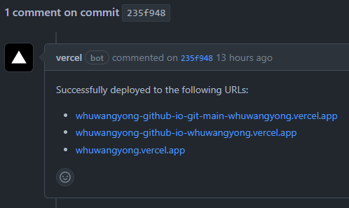
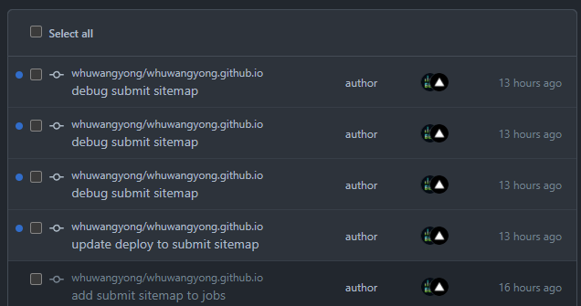
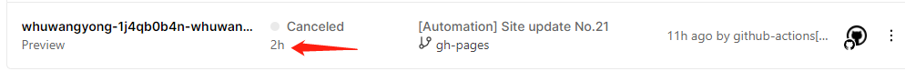
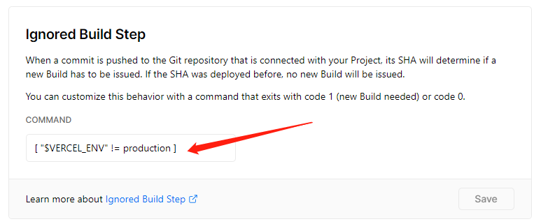

关键字：disable Vercel bot; disable Preview Deployments


[Vercel](https://vercel.com/)是一个支持部署前端框架和静态网站的平台。你可以方便的把 Github Pages 上面的站点导入Vercel，这样做有两个好处：

1. 有些地区有些时候，Vercel上面的站点比Github Pages上的访问速度快；
2. Github Pages 屏蔽了百度的爬虫，因此你的博客不能被百度检索到。但 Vercel 是可以的。

使用了一段时间的Vercel，发现有两个地方需要调整。

## 关闭评论

每次提交后，vercel bot会在该commit下评论：



这造成了大量的github通知和邮件通知：



如何关闭？在站点根目录新增`vercel.json`文件，内容如下：

```json
{
    "github": {
        "silent": true
    }
}
```

## 禁止Preview Deployments

另一个需要关闭的就是Preview Deployments（与我而言）。我的站点没有预览的必要，都是直接build main分支然后上production。Preview Deployments 构建的是`gh-pages`分支，可能是我哪里没弄对，这个分支一直无法build成功。如下图，2小时过去了还没结束，然后我手动取消了。  



因此，我禁止了Preview Deployments，直允许Production Deployments。操作如下：  
Project Settings -> Git -> Ignored Build Step，在 COMMAND 填入 `[ "$VERCEL_ENV" != production ]`。  
​

## Reference

1. [How do I prevent the Vercel for GitHub integration comments? – Vercel Docs](https://vercel.com/support/articles/how-to-prevent-vercel-github-comments)
2. [Using Vercel without preview deployments (codejam.info)](https://www.codejam.info/2021/09/vercel-without-preview-deployments.html#turning-off-preview-deployments-kinda)


