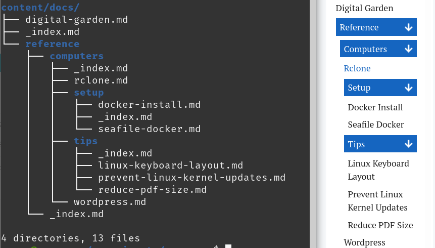
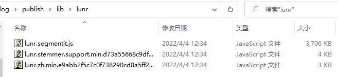
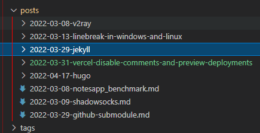

> 最好的参考资料仍然是[官方](https://gohugo.io/getting-started/quick-start/)。本文仅作一个基本描述
>

## 安装 Hugo

在[此处](https://github.com/gohugoio/hugo/releases)下载安装包。有两个版本：（1）hugo；（2）hugo_extended。怎么选？很多功能，包括一些主题，都需要 hugo_extended 的支持，因此，建议安装 hugo_extended。下载之后，解压，将 hugo.exe 加入环境变量即可。

## 创建站点

仅需一个命令：

```plaintext
> hugo new site my_blog
```

站点的目录结构如下：

```plaintext
> ls my_blog
Mode                 LastWriteTime         Length Name
----                 -------------         ------ ----
d-----         2022/4/16     16:32                archetypes
d-----         2022/4/16     16:32                content
d-----         2022/4/16     16:32                data
d-----         2022/4/16     16:32                layouts
d-----         2022/4/16     16:32                static
d-----         2022/4/16     16:32                themes
-a----         2022/4/16     16:32             82 config.toml
```

最关键的几个文件/目录:

1. config.toml 配置文件，要定制化的东西几乎全在这里修改。
2. themes 存放主题的目录。里面可以放一个或多个主题
3. content 存放博客的目录。后续以 markdown 格式写的文章，就放在这下面：

   ```plaintext
   content/
   └── posts/
       └── this-is-my-first-blog/        <-- page bundle
       |   ├── index.md
       |   └── sunset.jpg                <-- page resource
       └—— this-is-my-second-blog.md
   ```

   注意，如果将 md 文件和引用的图片放在一个文件夹下（官方叫 `page bundle`），则 md 文件需命令为 index.md，否则 md 在渲染为 html 后，里面的图片不会显示。

## 添加主题

新建的站点是空的，需要添加一个主题后才能正常使用。此处以 FixIt 主题为例。关于主题的选择，请看下一节**主题推荐**。

添加主题有两种方式：
（1）将主题下载下来，放在 themes 目录下即可
（2）将主题以子模块的形式添加到站点，使用 git 管理。这么做主要是便于以后升级。本文采用此方式。关于 git submodule 的更多信息查看这里：[git submodule - 标签 - 武大路飞 (whuwangyong.github.io)](https://whuwangyong.github.io/tags/git-submodule/)
另外，建议不要直接修改主题里面的文件，以后升级时合并起来很麻烦。没什么问题，主题可以一直使用，没必要频繁升级。

```bash
> cd my_blog
> git init
> git submodule add https://github.com/Lruihao/FixIt.git themes/FixIt

# 以后可以使用以下命令升级主题
> git submodule update --remote --merge
> git add .
> git commit -m "upgrade theme"
> git push
```

## 主题推荐

官网提供了很多主题，我试用了一些，从以下几个角度进行选择：

* [X] 用的人多，有人维护
* [X] 侧边栏具备 Markdown 大纲目录
* [X] 具备评论功能
* [X] 具备搜索功能
* [X] 简洁，美观，易用

最后选出了以下几个。

### Stack

[Stack | Hugo Themes (gohugo.io)](https://themes.gohugo.io/themes/hugo-theme-stack/)

特点：

1. 搜索很快
2. 首页和正文的间距都很大
3. 博客无修改时间
4. 分类与标签的样式是一样的
5. [favicon 图标设置](https://github.com/CaiJimmy/hugo-theme-stack/issues/272)：放在 `hugo-theme-stack/static/img/` 目录下，修改 `hugo-theme-stack/config.yaml`，设置 `params.favicon` 为 `/img/your-favicon.ico`，注意是 `/img` 不是 `img`
6. md 图片目录不能以 · 开始。否则渲染之后图片 src="/"是从根路径开始的，就找不到图片

### Bootstrap

[Bootstrap Theme for Personal Blog and Documentations | Hugo Themes (gohugo.io)](https://themes.gohugo.io/themes/hugo-theme-bootstrap/)

这个主题的特点是，默认采用的 `posts layout`，这个布局下面的文章，侧边栏的 `TOC` 目录是不固定的。如果需要固定，请使用 `docs layout`。

> This theme provides several kinds of layouts, such as `posts` and `docs`. Our documentations uses the `docs` layout. If you're looking for an example that using `posts` layout, please take a look at [Markdown Syntax](https://hbs-cn.razonyang.com/en/posts/markdown-syntax).
>
> ——from：[Docs Layout - Hugo Bootstrap (razonyang.com)](https://hbs-cn.razonyang.com/en/docs/layouts/docs/)
>

**优点**

1. 页面控件支持超宽布局
2. 代码控件支持超长代码折叠
3. Docs Layout 可以方便的将整个知识库放上去，这样本地的分类目录就能直接给博客使用，博客无需关心分类、标签的问题。

   

### ​LoveIt

[dillonzq/LoveIt: ❤️A clean, elegant but advanced blog theme for Hugo 一个简洁、优雅且高效的 Hugo 主题 (github.com)](https://github.com/dillonzq/LoveIt)

#### 搜索

LoveIt 主题支持"lunr"和"algolia"两种搜索：

**lunr**： 简单，配置 `type = "lunr"` 即可。运行 hugo 会将生成的 `index.json` 索引文件放在 `public/` 目录下，随网站一起发布。没有 `contentLength` 的限制，但占用带宽大且性能低 (特别是中文需要一个较大的分词依赖库)。客户端需将整个 `index.json` 从网站下载到本地，然后基于此文件进行搜索。下图是使用 lunr 搜索时，生成的静态文件，可见分词库有 3.6MB：
​

**algolia**：高性能并且占用带宽低，但需要将 `index.json` 上传到 algolia 官网（手动或使用 [Algolia Atomic](https://github.com/chrisdmacrae/atomic-algolia) 脚本）；有 `contentLength` 的限制。对于免费用户：Your first 10,000 records are free, and every month you’ll receive 10,000 requests for our Search and Recommend products.

经过测试，lunr 导致网站加载速度变慢，且搜索效果很不理想。所以我选择了 algolia。配置如下：注意 `index = "new-index-1649076215"`，后面的值是你在 algolia 网站上创建的索引名。

```yaml
[params.search]
    enable = true
    # 搜索引擎的类型 ("lunr", "algolia")
    type = "algolia"
    # 文章内容最长索引长度
    contentLength = 4000
    # 搜索框的占位提示语
    placeholder = ""
    # 最大结果数目
    maxResultLength = 10
    # 结果内容片段长度
    snippetLength = 50
    # 搜索结果中高亮部分的 HTML 标签
    highlightTag = "em"
    # 是否在搜索索引中使用基于 baseURL 的绝对路径
    absoluteURL = false
    [params.search.algolia]
      # 这里填写你在algolia上面创建的索引名
      index = "new-index-1649076215"
      appID = "YMLXXXXFHL"
      searchKey = "9028b251fe4eexxxxxxxxxxxxx5a4f0"
```

#### 多语言

所有写在 `[languages]` 外面的，都是所有语言公用的。[Multilingual Mode | Hugo (gohugo.io)](https://gohugo.io/content-management/multilingual)。我去故意掉了多语言，只保留了中文：将 `[languages.zh-cn]` 下面的所有配置挪到外面，然后删除空的 `[languages]` 块。

#### 使用本地资源

> 有三种方法来引用**图片**和**音乐**等本地资源:
>
> 1. 使用[页面包](https://gohugo.io/content-management/page-bundles/)中的[页面资源](https://gohugo.io/content-management/page-resources/). 你可以使用适用于 `Resources.GetMatch` 的值或者直接使用相对于当前页面目录的文件路径来引用页面资源。所谓的页面包，就是图片和 md 文件放在一起（使用相对路径访问）。
> 2. 将本地资源放在 **assets** 目录中, 默认路径是 `/assets`. 引用资源的文件路径是相对于 assets 目录的.
> 3. 将本地资源放在 **static** 目录中, 默认路径是 `/static`. 引用资源的文件路径是相对于 static 目录的.
>
> 引用的**优先级**符合以上的顺序.
>
> 在这个主题中的很多地方可以使用上面的本地资源引用, 例如  **链接** ,  **图片** , `image` shortcode, `music` shortcode 和**前置参数**中的部分参数.
>
> 页面资源或者 **assets** 目录中的[图片处理](https://gohugo.io/content-management/image-processing/)会在未来的版本中得到支持. 非常酷的功能!
>

#### Front Matter

https://hugoloveit.com/zh-cn/theme-documentation-content/#front-matter

#### 转义字符

https://hugoloveit.com/zh-cn/theme-documentation-content/#escape-character

#### SRI

启用之后在 github.io 有问题：

```plaintext
Failed to find a valid digest in the 'integrity' attribute for resource 'https://whuwangyong.github.io/lib/lunr/lunr.stemmer.support.min.d73a55668c9df0f2cbb2b14c7d57d14b50f71837e9d511144b75347e84c12ff8.js' with computed SHA-256 integrity 'EVRhgSylsJP5vMLxXSaTpskOj+ONq/I3Xl8Y4cNI2Xw='. The resource has been blocked.
whuwangyong.github.io/:1 
  
Failed to find a valid digest in the 'integrity' attribute for resource 'https://whuwangyong.github.io/lib/lunr/lunr.zh.min.e9abb2f5c7c0f738290cd8a5ff2ce1cf5deac6942f44ce5dd89c9ab1ae27006a.js' with computed SHA-256 integrity 's6qyS9abdG0o9DP0qC7PoVVqdbpe+fTKorzHq40yfBQ='. The resource has been blocked.
whuwangyong.github.io/:1 
  
Failed to find a valid digest in the 'integrity' attribute for resource 'https://whuwangyong.github.io/js/theme.min.09729ab43fbb7b49c065c597d41bb70983c7852ea77794a00b8f78099b049b43.js' with computed SHA-256 integrity '9Rk48wZaQO6EG8tVjkMw4x/SbA6lU0P/+HcLiLAxmjw='. The resource has been blocked.
```

页面现象就是侧边栏目录、评论都不显示。但是在 vercel.app 没问题。另外，console 还有个 warning：Error with Permissions-Policy header: Unrecognized feature: 'interest-cohort'.

#### LoveIt 总结

**优点**

* 文档很详细
* 默认在新标签页打开链接
* 可以设置代码超过 n 行折叠
* 标题加粗，更加清晰
* 使用 weight 置顶

  ```yaml
  ---
  weight: 1 # 置顶
  title: "主题文档 - 基本概念"
  date: 2020-03-06T21:40:32+08:00
  lastmod: 2020-03-06T21:40:32+08:00
  draft: false
  author: "Dillon"
  authorLink: "https://dillonzq.com"
  description: "探索 Hugo - LoveIt 主题的全部内容和背后的核心概念."
  resources:
  - name: "featured-image"
    src: "featured-image.jpg"

  tags: ["installation", "configuration"]
  categories: ["documentation"]

  lightgallery: true

  toc:
    auto: false
  ---
  ```

**缺点**

1. 搜索没有 jekyll + chirpy 的好，也没有 stack 的开箱即用。（`algolia` 要自己搞上传，`lunr` 分词有问题）。
2. 主题不太美观
3. 画廊。使用以下语法。不加“图片描述”不会激活。未使用画廊的图片，点击不会响应，只能右键新标签打开，放大查看。还有个小 bug，页面刷新后，图变小了。

   ```markdown
   
   ```
4. 最重要的，两年没维护了。但这个主题确实不错，所有有不少人 fork 了一份继续维护。我选择的是 [Lruihao/FixIt](https://github.com/Lruihao/FixIt)。

### FixIt

[Lruihao/FixIt: 🔧 A clean, elegant but advanced blog theme for Hugo 一个简洁、优雅且高效的 Hugo 主题 (github.com)](https://github.com/Lruihao/FixIt)

> 它的原型基于 [LoveIt 主题](https://github.com/dillonzq/LoveIt), [LeaveIt 主题](https://github.com/liuzc/LeaveIt) 和 [KeepIt 主题](https://github.com/Fastbyte01/KeepIt)。
>
> [LoveIt 主题](https://github.com/dillonzq/LoveIt) 对我们来说是一个很棒的 Hugo 主题，很抱歉的是它的存储库已经停止维护很长一段时间了，所以我重建了一个名为 FixIt 的新主题，这样我可以更好地 **Fix It** 并使它用户体验更好。
>

* 修改了高亮颜色，比 LoveIt 更素雅好看一些。LoveIt 的橙色行内代码太花了
* 可以更便捷的修改页面宽度，LoveIt 的页面略窄
* 但是，图片刷新之后变小的 bug 还没解决
* 几乎可以从 LoveIt 无缝迁移

其他的就去看官方文档吧。

### Echo

https://github.com/forecho/hugo-theme-echo

这个主题未体验，看了下觉得还不错，也列在这里吧。主要是到后面不想再折腾了……

### 关于主题选择的总结

我最后的选择是 [FixIt](https://github.com/Lruihao/FixIt)——[LoveIt](https://github.com/dillonzq/LoveIt) 的继续维护版。
其实我最喜欢的主题是 [Chirpy](https://chirpy.cotes.page/)，但这是 Jekyll 的主题。而 Jekyll 使用的 Kramdown 有问题，我做了很多尝试也无法解决，所以放弃了 Jekyll， 转 Hugo。

没有完美的主题，选择一个基本满足要求的即可。比起不断折腾主题，抓紧时间学习并输出优质内容更重要。另外，如果正在使用的主题有什么缺陷，首先应该仔细阅读官方文档和 issue 列表，寻找解决方案（这是一种能力），而不是立即去找一个新的主题代替它。因为，可能在换了主题之后，我发现新的主题在其他地方也有缺陷，最终落入“主题大师”的陷阱——在 N 个主题里面反复横跳，流于表面，没有任何定制或者解决问题的能力。

## 运行示例站点

添加主题后，主题一般都带有示例站点，在 exampleSite 目录下。将 exampleSite 目录下的所有文件拷贝到站点目录下（my_blog）。然后使用如下命令启动：

```bash
hugo server
```

访问 `localhost:1313` 即可查看效果。

> 如果报错“Twitter timeout”之类的，是因为示例站点里面有些 shortcode 会连接 twitter/YouTube 之类的东西，国内连不上。删掉相应文件即可。
>

## 自定义配置

配置文件是 config.toml 或 config.yaml，有详细注释。另外，演示站点一般也是主题的说明文档，有不明白的配置项，可以在演示站点上查阅，很方便。

## 新建文章

直接在 `content/posts` 目录下新建 xxx.md 即可。或者使用 `page bundle` 模式，将 index.md 和引用的图片放在同一文件夹。

也可以使用 `hugo new posts` 命令新建，`posts` 来源于主题提供的模板。如 FixIt 主题提供了以下模板：

```bash
> ls .\themes\FixIt\archetypes\

Mode                 LastWriteTime         Length Name
----                 -------------         ------ ----
d-----         2022/4/14     21:02                post-bundle
-a----         2022/4/14     21:02            151 default.md
-a----         2022/4/14     21:02           1044 friends.md
-a----         2022/4/14     21:02            179 offline.md
-a----         2022/4/14     21:02            633 posts.md
```

## 渲染

在站点目录下运行 `hugo` 命令即可。渲染之后的静态文件位于 public 目录下。将该目录下的所有文件放在一个 http 服务器下面，即可提供服务。比如，在 public 目录下，使用 python 命令运行一个 http 服务器：

```bash
> python -m http.server
Serving HTTP on :: port 8000 (http://[::]:8000/) ...
```

然后浏览器访问 `localhost:8000` 即查看该站点。

## 发布到 github pages

将上述渲染的结果——public 目录下的所有文件，提交到 `username.github.io` 这个 repo，即可发布到 github pages。

## 进阶内容

### 发布到 netlify、vercel

netlify、vercel 支持编译 hugo 源文件。因此，你可以直接提交 my_blog 下面的 hugo 源文件（包括你写的 md 文件、hugo 相关的配置、主题文件等等，不包括渲染后的 public/和渲染时生成的 resources/）到 github 的一个 repo，然后将该 repo 关联到 netlify、vercel，它们将会自动渲染并发布到它们的网站下。本站有相关文章，可以查看 netlify、vercel 标签。

### 脚本化处理

我写了一个 [python 脚本](https://github.com/whuwangyong/whuwangyong.github.io/blob/hugo-loveit/publish.py)来做渲染、发布等事情，供参考。

### 提交到 Google/百度/Bing 等搜索引擎

可以使用在 config.toml 中填写对应的配置；也可以将 Google/百度等提供的验证 html 文件放在站点的 static 目录下。渲染后，这些验证 html 文件会出现在 public/目录下。public/发布之后，它们就位于网站的根目录了，搜索引擎来抓取的时候就可以验证。

同样位于根目录的还有 `sitemap.xml`，这是网站地图，便于搜索引起爬取内容。另外，百度/Bing 还提供了提交 url 地址的 api。当你发布新文章后，可以手动或写脚本将 url 提交到搜索引擎，使文章更快地被收录。

## Tips

### 文章需要通过文件夹进行分类吗

在写了一些文章后，自然诞生出分类的想法。比如建站相关的，放在“建站”文件夹下；kafka 相关的，放在“kafka”目录下。

​

我的建议是不要这样做。因为分类是一个很难的事情，随着时间推移大概率会动态调整。调整之后意味着之前发布的博客的 url 失效。这对于 SEO 是很不利的，好不容易有个用户搜到了你的博客，一点进来却是 404。

类似的，posts 目录下的文件名、目录名，一经发布就不要改动。文章的标题和分类可以通过 Front Matter 修改：

```yaml
---
title: "使用Jekyll + Github Pages搭建静态网站"
date: 2022-03-29
tags: ["jekyll", "kramdown", "github pages"]
categories: ["静态网站博客"]
---
```

### hugo 时区问题导致文章未显示

比如现在时间是 2022-04-19 0:56，我要发一篇文章，Front Matter 写为：

```yaml
---
title: "使用 Hugo + Github Pages 创建静态网站博客"
date: 2022-04-19
tags: ["hugo"]
---
```

date 字段我一般只写日期，不写时间。好，现在问题来了，hugo server 一把，发现该文章未显示。这是因为 hugo 默认时区比中国时间慢 8 小时，当前还是 4 月 18 日。解决办法有 4 个：

1. 将 `date` 字段写详细：`date: 2022-04-19T00:56:00+08:00`
2. 修改 `config.toml`，添加一行配置，执行可以编译未来的文章：`buildfuture = true`
3. 使用 `hugo server --buildFuture` 或 `hugo --buildFuture` 命令
4. 修改 `config.toml`，添加一行配置，指定时区：`timezone = "Asia/Shanghai"`

推荐采用方法（4）。


