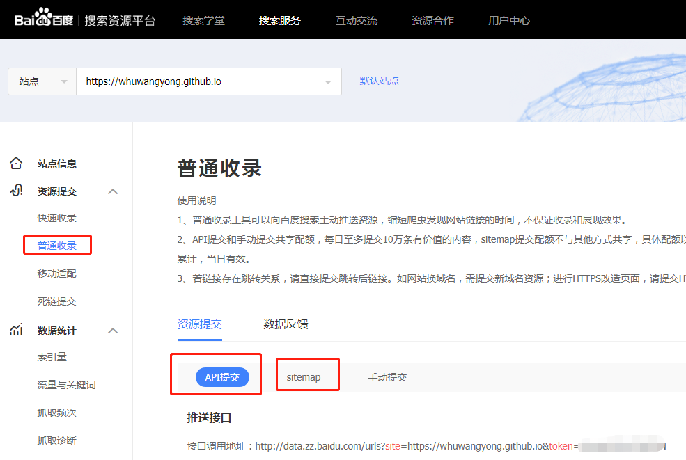
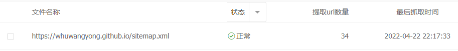
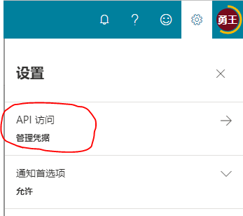
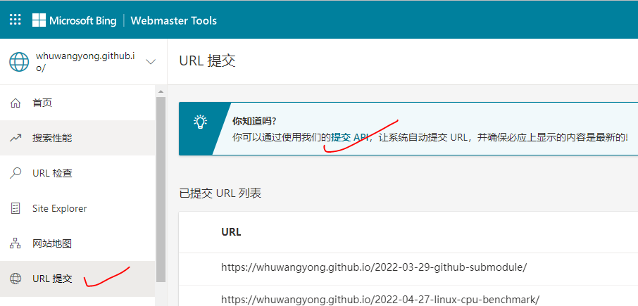

建站之后，为了文章能够被搜索引擎收录，我们需要将站点提交到Google、百度、Bing等搜索网站，通过验证之后，搜索引擎才会去我们的网站爬数据。

为了方便爬虫爬取我们站点里的文章，我们可以将站点地图（sitemap.xml）提交到搜索网站。提交之后，爬虫在光临我们的网站时，会根据sitemap.xml的指引，抓取所有的URL。

但是，爬虫光临我们站点的周期太长（至少要几天吧），如果想发布文章之后尽快被搜索引擎收录，我们可以主动提交URL到搜索网站。Google只能在网页上操作，百度和Bing都提供了API。下面介绍如何使用API提交URL。

## 生成url列表

在提交url之前，需先准备好url列表，形如：

```plaintext
http://www.your-site.com/1.html
http://www.your-site.com/2.html
```

有两种方式生成url列表。

### 从sitemap.xml获取

多数静态网站构建工具（Hugo、Jekyll）都会生成sitemap.xml，形如：

```xml
<urlset xmlns="http://www.sitemaps.org/schemas/sitemap/0.9" xmlns:xhtml="http://www.w3.org/1999/xhtml">
    <url>
        <loc>https://whuwangyong.github.io/2022-03-29-github-submodule/</loc>
        <lastmod>2022-04-27T23:14:33+08:00</lastmod>
        <changefreq>weekly</changefreq>
        <priority>1</priority>
    </url>
    <url>
        <loc>https://whuwangyong.github.io/2022-04-27-linux-cpu-benchmark/</loc>
        <lastmod>2022-04-27T23:14:33+08:00</lastmod>
        <changefreq>weekly</changefreq>
        <priority>1</priority>
    </url>
</urlset>
```

用以下Linux命令可以将sitemap.xml中的url提取出来：

```bash
grep "<loc>" sitemap.xml | grep -v 'html' | awk -F '[< >]' '{print $3}' > urls.txt
```

这样做的弊端是每次提交的url列表是全量的。而百度和Bing都限制了每天提交的数量，百度 3000条/天，Bing 100条/天。随着文章增多，可能会超限。因此，更好的做法是，每次只提交本次更新的文章的url，通过`git log`可以实现。

### 从git log获取

```bash
# 获取最近一次的commit_id
> git rev-parse --short HEAD
2bfe64f

# 显示本次提交修改的文件
> git diff-tree --no-commit-id --name-only -r 2bfe64f
2022-03-29-github-submodule/assets/image-20220404003800-3hsabzt.png
2022-03-29-github-submodule/index.html
2022-03-29-github-submodule/index.md
2022-04-27-linux-cpu-benchmark/index.html
2022-04-27-linux-cpu-benchmark/index.md
index.json
sitemap.xml

# 显示本次提交修改的文件 （另一种方法）
> git show --pretty="" --name-only 2bfe64f
2022-03-29-github-submodule/assets/image-20220404003800-3hsabzt.png
2022-03-29-github-submodule/index.html
2022-03-29-github-submodule/index.md
2022-04-27-linux-cpu-benchmark/index.html
2022-04-27-linux-cpu-benchmark/index.md
index.json
sitemap.xml
```

然后从修改文件列表中，删选出`.html`结尾的路径，与站点根目录拼起来，得到完整url。后文有提供python代码来生成url列表。

准备好了url列表，下面开始使用API提交。

## 百度收录API提交

登陆[百度搜索资源平台-站点管理](https://ziyuan.baidu.com/site/index)，选择资源提交-普通收录-API提交：



> 旁边的sitemap用于提交sitemap.xml文件，这个很简单，不多说：
>
> 
>

百度给出了4种API提交的方法：

### curl推送

将要提交的链接按照每行一条的格式写入一个文本文件中，命名此文件为urls.txt，然后执行：

```bash
curl -H 'Content-Type:text/plain' --data-binary @urls.txt "http://data.zz.baidu.com/urls?site=https://whuwangyong.github.io&token=xxxxx"
```

### post推送

也很简单，具体可以参考文末代码。

```plaintext
POST /urls?site=https://whuwangyong.github.io&token=your-token HTTP/1.1

User-Agent: curl/7.12.1
Host: data.zz.baidu.com
Content-Type: text/plain

data = [
    "http://www.example.com/1.html",
    "http://www.example.com/2.html"
]
```

### php推送、ruby推送

未尝试。

## Bing Webmaster API 提交

登录[Bing Webmaster Tools](https://www.bing.com/webmasters/about)，点击右上角设置-API访问，获取api key。



然后通过URL提交进入[提交API](https://www.bing.com/webmasters/url-submission-api#APIs)页面：



Bing提供了两种提交格式，json和xml。我使用的是json。接口约定如下：

```plaintext
JSON request sample: 

POST /webmaster/api.svc/json/SubmitUrlbatch?apikey=sampleapikeyEDECC1EA4AE341CC8B6 HTTP/1.1
Content-Type: application/json; charset=utf-8
Host: ssl.bing.com

{
    "siteUrl":"http://yoursite.com",
    "urlList":[
        "http://yoursite.com/url1",
        "http://yoursite.com/url2",
        "http://yoursite.com/url3"
    ]
}


JSON response sample:

HTTP/1.1 200 OK
Content-Length: 10
Content-Type: application/json; charset=utf-8

{
    "d":null
}
```

## 代码

```python
def commit_urls():
    print("将最新的url提交到百度和bing")
    os.system("git checkout gh-pages")
    urls = []

    # 生成url列表
    ret = subprocess.run(
        "git rev-parse --short HEAD", stdout=subprocess.PIPE, stderr=subprocess.PIPE
    )
    if ret.returncode == 0:
        commit_id = str(ret.stdout, "utf_8").strip()
        ret = subprocess.run(
            "git show --pretty=" " --name-only " + commit_id,
            stdout=subprocess.PIPE,
            stderr=subprocess.PIPE,
        )
        if ret.returncode == 0:
            changes = str(ret.stdout, "utf-8").split("\n")
            for change in changes:
                if change.endswith(".html"):
                    # change[:-10] 是为了去掉末尾的index.html
                    urls.append("https://whuwangyong.github.io/{}".format(change[:-10]))
        else:
            print("subprocess run error:{}".format(ret.stderr))
    else:
        print("subprocess run error:{}".format(ret.stderr))

    print("本次提交的urls:", urls)

    # 提交到bing
    headers = {
        "Content-Type": "application/json; charset=utf-8",
        "Host": "ssl.bing.com",
    }
    data = {"siteUrl": "your-site.com", "urlList": urls}
    response = requests.post(
        url="https://www.bing.com/webmaster/api.svc/json/SubmitUrlbatch?apikey=your-key",
        headers=headers,
        data=json.dumps(data)
    )
    print("bing的响应: ", response.content)

    # 提交到百度
    headers = {
        "User-Agent": "curl/7.12.1",
        "Host": "data.zz.baidu.com",
        "Content-Type": "text/plain"
    }
    response = requests.post(
        url="http://data.zz.baidu.com/urls?site=your-site.com&token=your-token",
        headers=headers,
        data="\n".join(urls)
    )
    print("百度的响应: ", response.content)
```

运行结果：

```plaintext
> python commit_urls.py

将最新的url提交到百度和bing
Switched to branch 'gh-pages'
Your branch is up to date with 'origin/gh-pages'.
本次提交的urls: ['https://whuwangyong.github.io/2022-03-29-github-submodule/', 'https://whuwangyong.github.io/2022-04-27-linux-cpu-benchmark/']
bing的响应:  b'{"d":null}'
百度的响应:  b'{"remain":2998,"success":2}'
```


