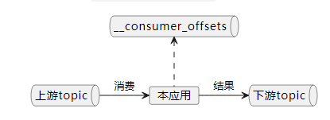
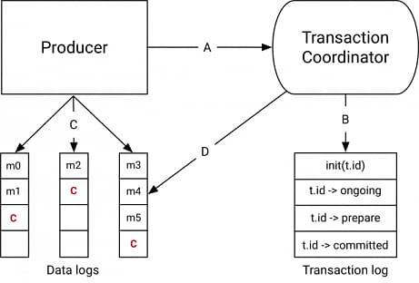
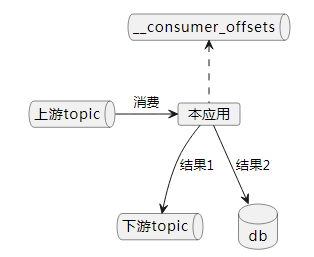
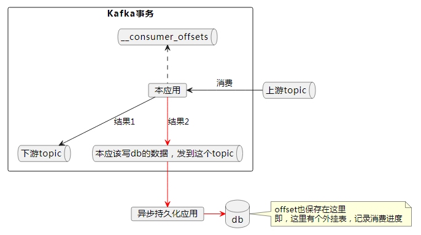

### Kafka的事务是什么

生产者往多个topic里面写消息，要么同时成功，要么同时失败。

### 为什么需要事务

消息系统有3种语义：

1. 最多一次
2. 最少一次
3. 精确一次。Exactly Only Once

为了实现精确一次的语义，Kafka必须引入事务。如下图：

本应用从上游topic消费消息，处理后发到下游topic，同时将处理进度发送到`__consumer_offsets`topic里面进行保存，对这两个topic的写，是一个原子操作（atomic）。




如果没有事务，发生以下情况时，消息可能会重复或者丢失：

> * A broker can fail
> * The producer-to-broker RPC can fail
> * The client can fail
>

### Zombie instances

在分布式系统中，主节点由于网络闪断等原因，被一致性协议踢出，过了一会儿又恢复过来，并希望与现任主节点做同样的事情。前任主节点就是zombie instances。

### Zombie fencing

> We solve the problem of zombie instances by requiring that each transactional producer be assigned a unique identifier called the  *transactional.id* . This is used to identify the same producer instance across process restarts.
>

*transactional.id* 能够跨越进程重启。也就是说，当主节点宕机后，备节点使用主节点的*transactional.id* 继续干活，是可以的。也就说，事务id “is consistent across producer sessions”。

### 代码

```java
//Read and validate deposits validated
Deposits = validate(consumer.poll(0))

//Send validated deposits & commit offsets atomically
producer.beginTransaction() 
producer.send(validatedDeposits) 
producer.sendOffsetsToTransaction(offsets(consumer)) 
producer.endTransaction()
```


### How Transactions Work



### The Transaction Coordinator and Transaction Log

> The transaction coordinator is a module running **inside every Kafka broker**. The transaction log is an **internal kafka topic**. Each coordinator owns some subset of the partitions in the transaction log, ie. the partitions for **which its broker is the leader**.
>
> Every transactional.id is mapped to a specific partition of the transaction log through a simple hashing function. This means that exactly one coordinator owns a given transactional.id.
>

每个broker里面都有一个事务协调者。transaction log是一个内部topic。

### Data flow

4个阶段

1. 生产者与协调者的交互

    1. 生产者使用initTransactions API向协调者注册一个事务id。此时，协调者会close所有具有相同事务id且处于pending状态的事务，并把其epoch 纳入 fence out zombies
    2. 生产者在一个事务里第一次对一个分区发消息时，该分区会在协调者注册
    3. 应用调用commit或abort方法时，客户端会发一个请求到协调者，协调者开始做二阶段提交
2. 协调者与transaction log的交互

    协调者是唯一一个读写transaction log的组件。
3. 生产者写数据到目标分区
4. 协调者与目标分区的交互

    生产者commit或abort时，协调者开始执行2PC：

    1. 在内存更新事务状态为“prepare_commit”，也更新transaction log里的状态
    2. 将 **commit markers** 写到本事务涉及到的topic-partitions
    3. 更新事务状态为“complete”

### How to pick a transactional.id

> The transactional.id plays a major role in fencing out zombies. But maintaining an identifier that is consistent across producer sessions and also fences out zombies properly is a bit tricky.
>
> The key to fencing out zombies properly is to ensure that the input topics and partitions in the read-process-write cycle is always the same for a given transactional.id. If this isn’t true, then it is possible for some messages to leak through the fencing provided by transactions.
>
> For instance, in a distributed stream processing application, suppose topic-partition *tp0* was originally processed by transactional.id *T0. *If, at some point later, it could be mapped to another producer with transactional.id *T1, *there would be no fencing between *T0* and *T1. *So it is possible for messages from *tp0* to be reprocessed, violating the exactly-once processing guarantee.
>
> Practically, one would either have to store the mapping between input partitions and transactional.ids in an external store, or have some static encoding of it. Kafka Streams opts for the latter approach to solve this problem.
>

### How transactions perform, and how to tune them

Performance of the transactional producer 事务的性能开销

Transactions cause only moderate write amplification（有限的写放大）. The additional writes are due to:

1. additional RPCs to register the partitions with the coordinator
2. transaction marker has to be written to each partition
3. write state changes to the transaction log

事务提交的批次越小、间隔越小，性能损耗越大。对于1KB消息，每100ms提交一次，吞吐下降3%。但是，批次（间隔）越大，消息的实时性越差。

事务对消费者来说几乎没性能损失。

### 幂等producer与事务producer

* 幂等producer，其id是没持久化的。重启后会变。
* 事务producer，其id是事务id。这个id在producer重启后也不会变。
* 虽然producer重启后事务id不会变，但是，一个新的producer session创建时，会再次执行initTransactions()，epoch会增加。假设旧的producer并没彻底宕机，当它恢复过来时，尝试使用旧的epoch提交事务，就会报错。

### 事务型消费者，可以消费未启用事务的普通消息吗

可以。

> 官方文档对**isolation.level**的描述：
>
> If set to  `read_committed` , consumer.poll() will only return transactional messages which have been committed. If set to  `read_uncommitted`(the default), consumer.poll() will return all messages, even transactional messages which have been aborted. **Non-transactional messages will be returned unconditionally in either mode**.
>
> 最后一句：不管在哪种模式下，非事务的消息都是无条件返回。


### 如何实现跨数据源的事务：kafka+DB混合事务

对于如下的一个逻辑：



本应用消费上游topic的消息，然后将结果1发送到下游topic，同时将结果2写入db，另外还要提交消费进度到`__consumer_offsets`topic。如何保证这3个写操作是一个事务？kafka的事务并不支持跨数据源。官方文档如下：

> When writing to an external system, the limitation is in the need to coordinate the consumer's position with what is actually stored as output. The classic way of achieving this would be to introduce a two-phase commit between the storage of the consumer position and the storage of the consumers output. But this can be handled more simply and generally by letting the consumer store its offset in the same place as its output.
>
> —— [Apache Kafka Documentation - 4.6 Message Delivery Semantics](https://kafka.apache.org/documentation/#semantics)
>
> The main restriction with Transactions is they only work in situations where both the input comes from Kafka and the output is written to a Kafka topic. If you are calling an external service (e.g., via HTTP), updating a database, writing to stdout, or anything other than writing to and from the Kafka broker, transactional guarantees won’t apply and calls can be duplicated. This is exactly how a transactional database works: the transaction works only within the confines of the database, but because Kafka is often used to link systems it can be a cause of confusion. Put another way, Kafka’s transactions are not inter-system transactions such as those provided by technologies that implement [XA](https://en.wikipedia.org/wiki/X/Open_XA "X/Open XA").
>
> —— [What Can't Transactions Do?](https://developer.confluent.io/learn/kafka-transactions-and-guarantees/#what-cant-transactions-do)
>

官方建议，“letting the consumer store its offset in the same place as its output”，将输出保存到同一数据源：要么全部写数据库（消费进度也存在数据库里），此时可以用数据库的事务；要么全部写kafka。

根据这种思路，提供设计如下：



结果2也写到kafka里面，这样写结果1+结果2+消费进度是一个kafka事务，可以做到精确一次消费。然后单独写一个持久化线程，将数据从kafka里面消费，写到db。**注意写db的时候，需要将消费进度一起写入db，利用数据库事务来确保精确一次持久化。**

### Reference

1. [Exactly Once Processing in Kafka with Java | Baeldung](https://www.baeldung.com/kafka-exactly-once)
2. [Kafka: The Definitive Guide(2nd Edition)](https://resources.confluent.io/all-content/kafka-the-definitive-guide-v2)
3. [Apache Kafka Documentation](https://kafka.apache.org/documentation/)
4. [Transactions in Apache Kafka | Confluent](https://www.confluent.io/blog/transactions-apache-kafka/)
5. [Building Systems Using Transactions in Apache Kafka® (confluent.io)](https://developer.confluent.io/learn/kafka-transactions-and-guarantees/)
6. [Exactly-once Semantics is Possible: Here's How Apache Kafka Does it (confluent.io)](https://www.confluent.io/blog/exactly-once-semantics-are-possible-heres-how-apache-kafka-does-it/)
