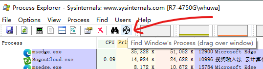

有时候电脑右下角、正中间弹出的广告，没有任何logo和落款，不知道是哪个软件搞的。这就好比挨了一拳，没看见出拳的人。

微软的一个大佬开发的 [Process Explorer](https://docs.microsoft.com/en-us/sysinternals/downloads/process-explorer) 功能强大，能解决这个问题。将工具栏上的瞄准镜拖动到广告弹窗上面即可。

