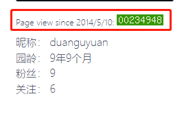
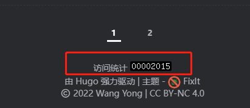
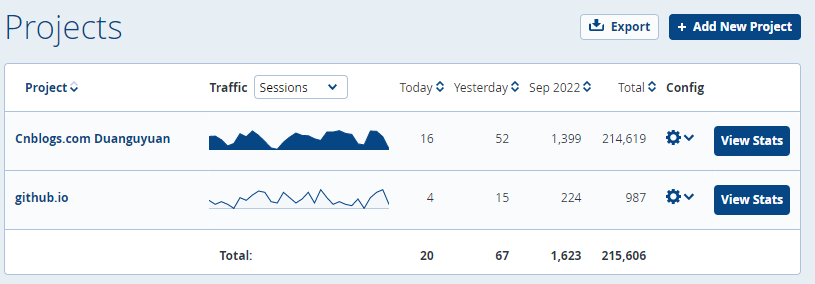
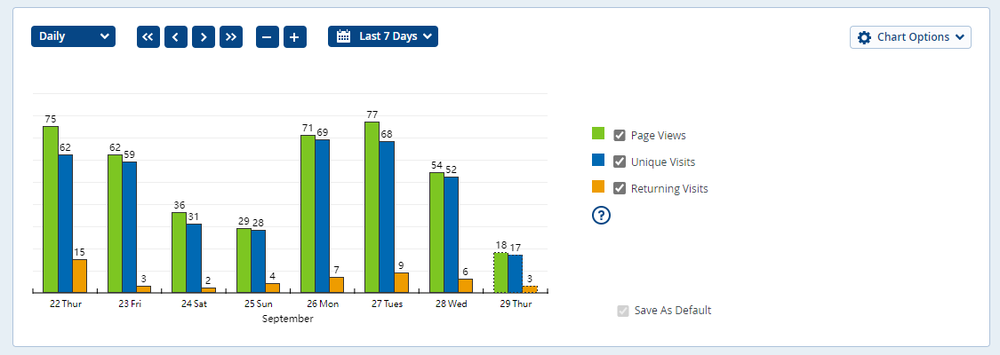
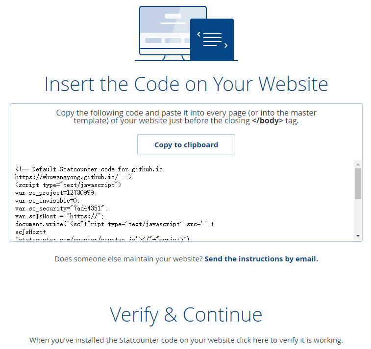
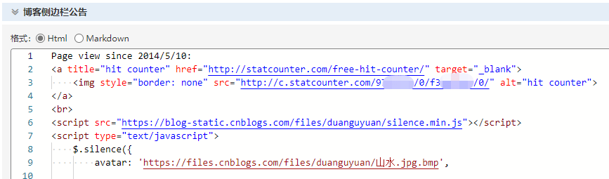
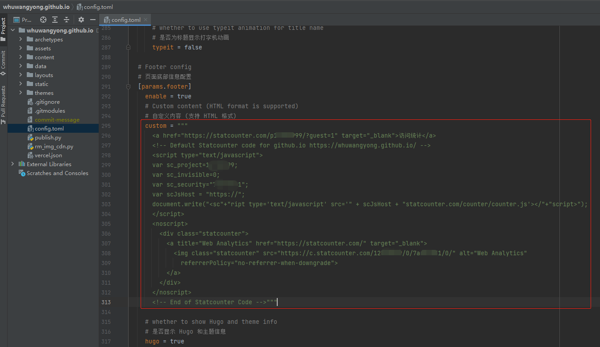

# 使用statcounter做访问统计

## 先看效果

博客园：

​

github.io：

​

statcounter后台：

​

> 没啥访问量，见笑了……
>

## 如何实现

本质是将statcounter生成的一段代码，放到自己的网站上就可以了。

### 注册并生成代码

注册，新建project，选择 FREE 计划即可：

然后填写你的博客地址，给project取个名字。然后代码就有了。后续在project config里面也能找到：

​

> 下面 Verify & Continue 可以不管，他这个校验多半会失败，只要自己测试发现生效就行了。
>

### 将代码放到博客园

登录博客园，在[后台设置](https://i.cnblogs.com/settings)页面，将删除代码贴到侧边栏公告：

> 注意，由于我博客园使用得比较早，当时statcounter提供的是另一种方案（现在没有了）。这种方案，需要将一个silence.min.js文件上传到自己的博客（博客园后台-文件），然后再引用，如第6行所示。
>
> 现在的方案是直接引用statcounter的文件（`statcounter.com/counter/counter.js`），直接贴代码就完事，无需上传。当然为了加速，也可以把这个文件放到自己网站上再本地引用。
>

​

### 将代码放到github.io

statcounter官方说了，需要将生成的代码放在每个网页，或者每个网页都使用的公共模板。

我的博客是用Hugo创建的，可以通过修改config.toml文件，在所有页面的底部添加访问统计的代码：

​

其他博客平台或者主题，可以在类似的地方进行添加。

## 后续

statcounter还有一些其他的功能，如设置显示的类型PV/UV、邮件报告、样式等等，大家自己探索。 

‍
