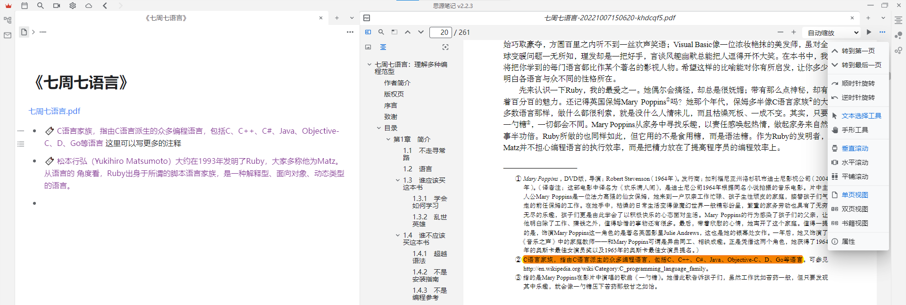
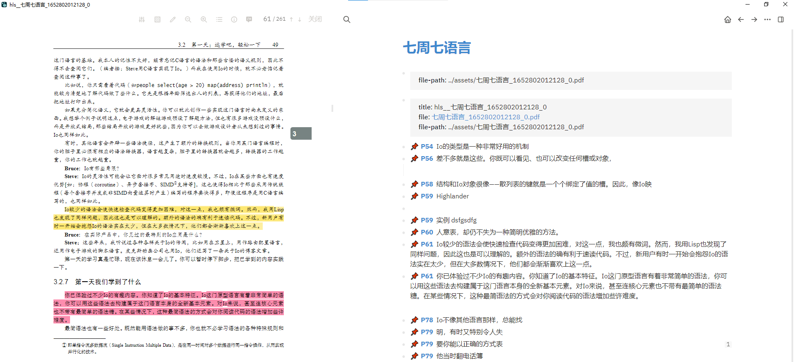

> 版本：思源2.2.3，logseq 0.8.8

## 功能对比

|功能|思源|logseq|
| ---------------------------| ------| --------|
|目录/书签|Y|Y|
|高亮、批注、矩形选择|Y|Y|
|页面缩放、跳转|Y|Y|
|关键字搜索|Y|N|
|高亮内容自动添加到笔记|N|Y|
|笔记与PDF原文之间互相跳转|Y|Y|

logseq的明显短板是没有全文搜索，这个应该不难，不知道为啥没做（2023年更新，现在有了）。

明显优势是，高亮文本时，自动将选中的内容复制到笔记，并创建双向链接。而思源需要手动粘贴。但手动粘贴也有个好处，可以自由选择粘贴的位置。logseq的自动粘贴只会放在末尾。

两个笔记软件都只提供了高亮功能，那么文本批注是如何实现的呢？答案是在笔记里添加额外内容作为批注。与普通的PDF阅读器不同，笔记软件的批注是保存在笔记里，而不是PDF文件里。

思源笔记可以在鼠标悬停PDF正文高亮部分时，浮窗展示对应的笔记内容。logseq是二次点击之后跳转到对应的笔记。

## 思源阅读PDF时的界面

​

## logseq阅读PDF时的界面

​

## 结论

两个笔记软件在PDF阅读上都不完美。

所以我还是选择福昕、WPS PDF等软件阅读PDF。读完后导出注释，再放进笔记里。缺点就是不能便捷地从笔记跳转到对应的原文，PDF文件没有被笔记软件管理。但是导出的注释里有页面，手动翻一下也行……

> 注意：高亮文本的导出，我发现目前仅有福昕阅读器支持。
