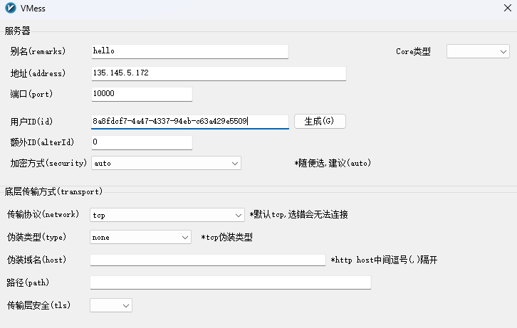
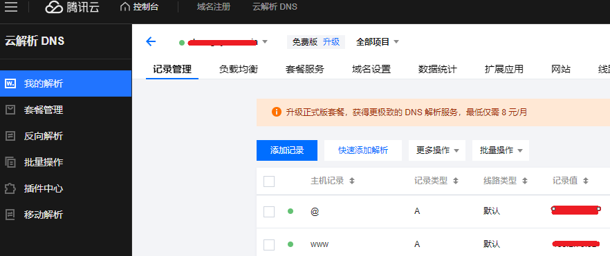
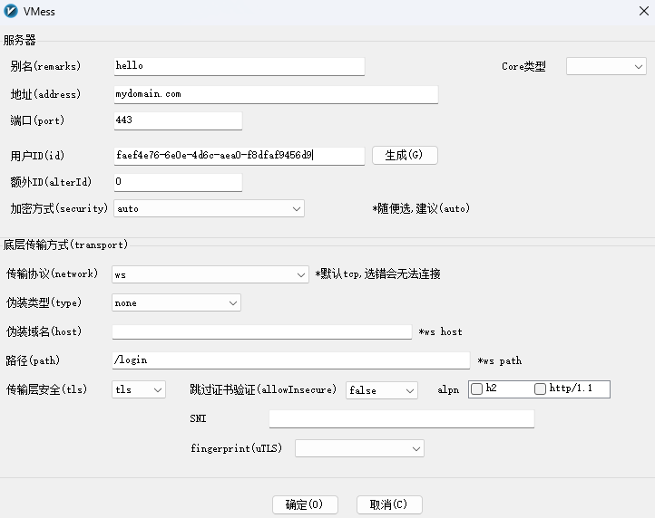
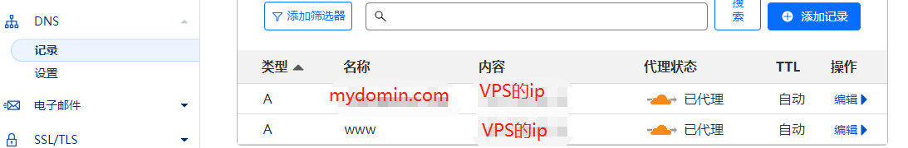
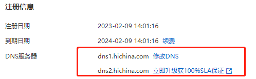
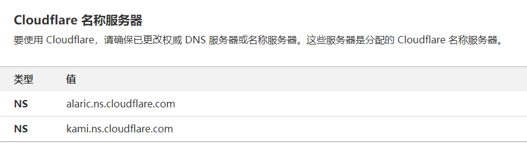
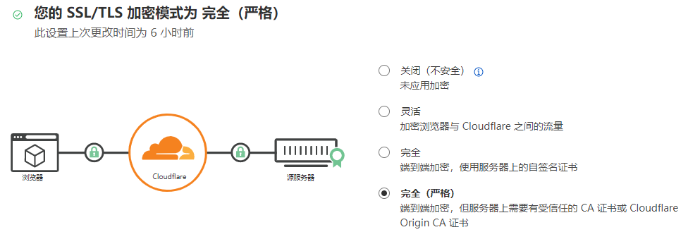
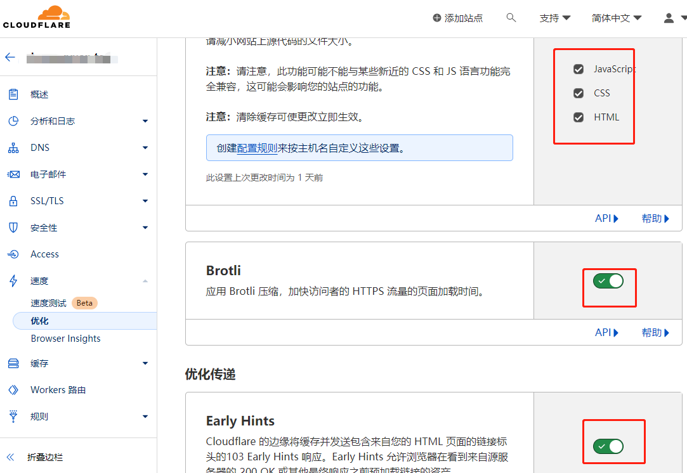
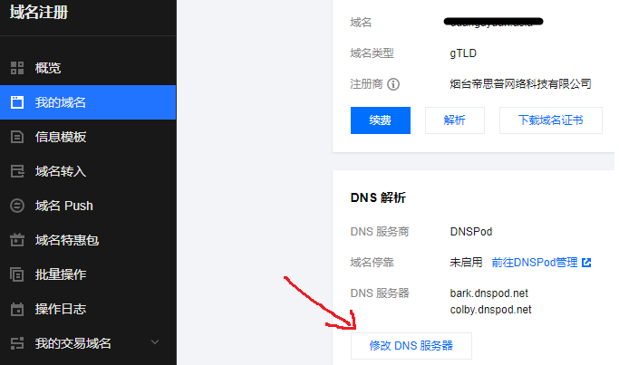

# V2Ray+WebSocket+TLS+Web+Cloudflare教程

## 背景

一般来说，装好V2Ray之后就可以科学上网了，但是IP经常被封，固有此方案。

WebSocket+TLS+Web的组合怎么来的？这个组合意思是，在机器上部署一个web站点，使用 Nginx/Caddy/Apache 可以将 V2Ray 稍作隐藏。使用 WebSocket 是因为搭配 Nginx/Caddy/Apache 只能用 WebSocket，使用 TLS 是因为可以流量加密，看起来更像 HTTPS。也就是说，我们的机器看起来是个正常的网站，当访问特定的path，可以把流量转发给V2Ray。

Cloudflare是一个CDN，可以代理所有的流量，同时隐藏真实的IP，这样IP被封的几率就小了。

## 准备

1. 用来科学上网的VPS机器，可以SSH登录
2. 一个域名，我使用的是阿里云的，4块一年，到期了再换，买便宜的就行。本文以`mydomain.com`​域名作为演示。

下面开始。**建议先通读全文，理解每一步在做什么，不要立即动手，照着命令一顿敲。**

## 1 安装v2ray

> 如果已经装好了v2ray且能通过ip正常使用，跳过这一步

官方文档：[fhs-install-v2ray/README.zh-Hans-CN.md at master · v2fly/fhs-install-v2ray (github.com)](https://github.com/v2fly/fhs-install-v2ray/blob/master/README.zh-Hans-CN.md)

​`sudo su`​切换到root用户，执行：

```bash
bash <(curl -L https://raw.githubusercontent.com/v2fly/fhs-install-v2ray/master/install-release.sh)
```

### 配置服务端

位于`/usr/local/etc/v2ray/config.json`​

```json
{
  "inbounds": [
    {
      "port": 10000, // 服务器监听端口
      "protocol": "vmess",    // 主传入协议
      "settings": {
        "clients": [
          {
            "id": "faef4e76-6e0e-4d6c-aea0-f8dfaf9456d9",  // 用户 ID
            "alterId": 0 // 新版本不能设置为64

          }
        ]
      }
    }
  ],
  "outbounds": [
    {
      "protocol": "freedom",  // 主传出协议
      "settings": {}
    }
  ]
}
```

上面的用户ID是UUID，可以理解为密码，请修改为自己的，这里可以在线生成：[Online UUID Generator Tool](https://www.uuidgenerator.net/)

### 启动V2Ray

​​sudo systemctl restart v2ray.service​

### 配置Windows客户端

在这里下载：[2dust/v2rayN: A V2Ray client for Windows, support Xray core and v2fly core (github.com)](https://github.com/2dust/v2rayN)。安装后[添加VMess服务器]，核心字段就是VPS的ip、端口、用户ID：（这里也能生成ID，与服务端配置保持一致即可）

​​

然后试用一下能不能上谷歌，可以的话说明V2Ray安装正确，进入下一步。

## 2 部署一个Web站点

安装Nginx：

sudo apt install nginx

新建站点目录：

cd /var/www  
sudo mkdir mydomain.com

然后在该目录下放一个静态页面，内容随便（可以去github找些静态网站放在这个目录）：

cd mydomain.com  
sudo echo "hello" > index.html

配置virtual host：

cd /etc/nginx/sites-available  
touch mydomain.com  
vim mydomain.com，内容如下：

```plaintext
server {
       listen 80; # 本站监听80端口
       server_name mydomain.com; # 虚拟主机名

       root /var/www/mydomain.com; # 本网站的根目录
       index index.html; # 主页

       location / {
               try_files $uri $uri/ =404;
       }
}
```

然后将默认配置文件改为刚刚创建的站点配置文件：

cd /etc/nginx/sites-enabled  
sudo ln -s /etc/nginx/sites-available/mydomain.com default

重启Nginx：

sudo systemctl restart nginx.service

## 3 设置域名解析

登录阿里云控制台，进入域名列表，为自己的域名设置解析记录：添加一条A记录，让该域名指向你的VPS机器的ip。然后验证能否通过域名访问自己的web站点。在浏览器输入`http://mydomain.com`​，如果不能访问，检查VPS的防火墙是否放开了80端口。

腾讯云截图：

​、（当后面使用CloudFlare的DNS服务器时，就可以不在这里设置解析记录了，而是在CloudFlare那边设置）。

## 4 给Web站点安装TLS证书

按照[certbot](https://certbot.eff.org/instructions?ws=nginx&os=ubuntufocal)的指南操作：

```plaintext
# 安装 certbot
sudo apt install snapd
sudo apt remove certbot
sudo snap install --classic certbot
sudo ln -s /snap/bin/certbot /usr/bin/certbot

# 下面这一步就是生成证书并安装到Nginx，有一些交互性的操作，按提示操作即可
sudo certbot --nginx
```

> 贴一下我的安装日志：
>
> ```
> ubuntu@instance-3c23g-220418:~$ sudo certbot --nginx
> Saving debug log to /var/log/letsencrypt/letsencrypt.log
>
> Which names would you like to activate HTTPS for?
> We recommend selecting either all domains, or all domains in a VirtualHost/server block.
> - - - - - - - - - - - - - - - - - - - - - - - - - - - - - - - - - - - - - - - -
> 1: mydomain.com
> - - - - - - - - - - - - - - - - - - - - - - - - - - - - - - - - - - - - - - - -
> Select the appropriate numbers separated by commas and/or spaces, or leave input
> blank to select all options shown (Enter 'c' to cancel): 
> Certificate not yet due for renewal
>
> You have an existing certificate that has exactly the same domains or certificate name you requested and isn't close to expiry.
> (ref: /etc/letsencrypt/renewal/mydomain.com.conf)
>
> What would you like to do?
> - - - - - - - - - - - - - - - - - - - - - - - - - - - - - - - - - - - - - - - -
> 1: Attempt to reinstall this existing certificate
> 2: Renew & replace the certificate (may be subject to CA rate limits)
> - - - - - - - - - - - - - - - - - - - - - - - - - - - - - - - - - - - - - - - -
> Select the appropriate number [1-2] then [enter] (press 'c' to cancel): 2
> Renewing an existing certificate for mydomain.com
>
> Successfully received certificate.
> Certificate is saved at: /etc/letsencrypt/live/mydomain.com/fullchain.pem
> Key is saved at:         /etc/letsencrypt/live/mydomain.com/privkey.pem
> This certificate expires on 2024-01-22.
> These files will be updated when the certificate renews.
> Certbot has set up a scheduled task to automatically renew this certificate in the background.
>
> Deploying certificate
> Successfully deployed certificate for mydomain.com to /etc/nginx/sites-enabled/default
> Your existing certificate has been successfully renewed, and the new certificate has been installed.
>
> - - - - - - - - - - - - - - - - - - - - - - - - - - - - - - - - - - - - - - - -
> If you like Certbot, please consider supporting our work by:
>  * Donating to ISRG / Let's Encrypt:   https://letsencrypt.org/donate
>  * Donating to EFF:                    https://eff.org/donate-le
> - - - - - - - - - - - - - - - - - - - - - - - - - - - - - - - - - - - - - - - -
>
> ```
>
> 如上所述，Certbot提到，它设置了定时任务，会定期更新证书。这个定时任务不在crontable里面，在 `systemctl list-timers`​里：
>
> ```
> ubuntu@instance-3c23g-220418:/etc/nginx/sites-available$ systemctl list-timers
> NEXT                        LEFT          LAST                        PASSED        UNIT                         ACTIVATES         
> Tue 2023-10-24 02:18:55 UTC 28min left    Mon 2023-10-23 12:07:04 UTC 13h ago       apt-daily.timer              apt-daily.service   
> Tue 2023-10-24 04:14:00 UTC 2h 24min left Mon 2023-10-23 15:56:01 UTC 9h ago        snap.certbot.renew.timer     snap.certbot.renew.service  
>
> ```

‍

证书装好了之后，再看Nginx的配置文件，发现里面多了一些内容：

cd /etc/nginx/sites-enabled  
cat default：（这个default是指向mydomain.com文件的）

```plaintext
server {
  
       server_name mydomain.com;

       root /var/www/mydomain.com;
       index index.html;

       location / {
               try_files $uri $uri/ =404;
       }

    listen 443 ssl; # managed by Certbot
    ssl_certificate /etc/letsencrypt/live/mydomain.com/fullchain.pem; # managed by Certbot
    ssl_certificate_key /etc/letsencrypt/live/mydomain.com/privkey.pem; # managed by Certbot
    include /etc/letsencrypt/options-ssl-nginx.conf; # managed by Certbot
    ssl_dhparam /etc/letsencrypt/ssl-dhparams.pem; # managed by Certbot
}
server {
    if ($host = mydomain.com) {
        return 301 https://$host$request_uri;
    } # managed by Certbot


    listen 80;
    server_name mydomain.com;
    return 404; # managed by Certbot


}
```

可见，以`managed by Certbot`​注释结尾的就是certbot添加的内容。配置的意思是，监听443端口，如果通过80端口访问，则重定向到443。也就是说，现在在浏览器访问`http://mydomain.com`​，将会被重定向到`https://mydomain.com`​。

重启nginx服务，添加防火墙规则放行443端口。若浏览器可以访问`https://mydomain.com`​，说明证书无问题，进入下一步。

## 5 Nginx分流

现在流量全都去自己的Web网站了，科学上网怎么办？设置Nginx的path，将特定path的流量转发到V2Ray服务：

### 修改Nginx配置

cd /etc/nginx/sites-enabled  
sudo vim default （这个default是指向mydomain.com文件的）

将下面这段内容，添加到监听443端口的server里面：

```plaintext
location /login { # 与 V2Ray 配置中的 path 保持一致
        if ($http_upgrade != "websocket") { # WebSocket协商失败时返回404
            return 404;
        }
        proxy_redirect off;
        proxy_pass http://127.0.0.1:10000; # 假设WebSocket监听在环回地址的10000端口上
        proxy_http_version 1.1;
        proxy_set_header Upgrade $http_upgrade;
        proxy_set_header Connection "upgrade";
        proxy_set_header Host $host;
        # Show real IP in v2ray access.log
        proxy_set_header X-Real-IP $remote_addr;
        proxy_set_header X-Forwarded-For $proxy_add_x_forwarded_for;
  }
```

上述配置的意思是，当访问`https://mydomain.com/login`​时，将其转发到10000端口，而10000端口就是V2Ray服务的监听端口。

> login可以随便写，使用login是为了让这个网站看起来更加“正常”。虽然TLS会加密URL path。

添加后的效果为：

```plaintext
server {
  
       server_name mydomain.com;

       root /var/www/mydomain.com;
       index index.html;

       location / {
               try_files $uri $uri/ =404;
       }

    listen 443 ssl; # managed by Certbot
    ssl_certificate /etc/letsencrypt/live/mydomain.com/fullchain.pem; # managed by Certbot
    ssl_certificate_key /etc/letsencrypt/live/mydomain.com/privkey.pem; # managed by Certbot
    include /etc/letsencrypt/options-ssl-nginx.conf; # managed by Certbot
    ssl_dhparam /etc/letsencrypt/ssl-dhparams.pem; # managed by Certbot

    location /login { # 与 V2Ray 配置中的 path 保持一致
        if ($http_upgrade != "websocket") { # WebSocket协商失败时返回404
            return 404;
        }
        proxy_redirect off;
        proxy_pass http://127.0.0.1:10000; # 假设WebSocket监听在环回地址的10000端口上
        proxy_http_version 1.1;
        proxy_set_header Upgrade $http_upgrade;
        proxy_set_header Connection "upgrade";
        proxy_set_header Host $host;
        # Show real IP in v2ray access.log
        proxy_set_header X-Real-IP $remote_addr;
        proxy_set_header X-Forwarded-For $proxy_add_x_forwarded_for;
  }


}
server {
    if ($host = mydomain.com) {
        return 301 https://$host$request_uri;
    } # managed by Certbot


       listen 80;

       server_name mydomain.com;
    return 404; # managed by Certbot


}
```

### 修改V2Ray配置

sudo vim /usr/local/etc/v2ray/config.json

```json
{
    "inbounds": [
        {
            "port": 10000,
            "listen": "127.0.0.1",
            "protocol": "vmess",
            "settings": {
                "clients": [
                    {
                        "id": "faef4e76-6e0e-4d6c-aea0-f8dfaf9456d9",
                        "alterId": 0
                    }
                ]
            },
            "streamSettings": {
                "network": "ws",
                "wsSettings": {
                    "path": "/login"
                }
            }
        }
    ],
    "outbounds": [
        {
            "protocol": "freedom",
            "settings": {}
        }
    ]
}
```

可见，是在原来的基础上，添加了如下配置：

```plaintext
"streamSettings": {
    "network": "ws",
    "wsSettings": {
        "path": "/login"
    }
}
```

重启Nginx和v2ray服务。

### 修改v2ray客户端配置

​​

与最开始的配置相比，有以下几点变化：

* 地址：之前是VPS机器的IP，变为域名了
* 端口：之前直接写的v2ray服务端的端口，现在是443端口
* 传输协议：之前是TCP，现在是WebSocket(ws)
* 然后有一个路径：login
* 传输安全性：之前没有，现在是TLS

改了客户端配置后，再试一下能不能访问谷歌，如果一些顺利的话，进入下一步。

## 6 使用Cloudflare隐藏IP

到前面为止，虽然我们配置了使用域名来访问v2ray，但是阿里云的DNS解析服务依然受监管，依然知道我们的流量最终去到了哪个IP。如果我们的流量比较异常，还是会被揪出来，IP还是会被封。因此，可以使用Cloudflare的DNS服务器，增加一层保护，稳一点是一点。

cloudflare 是一家国外的 CDN 加速服务商，注册之后，添加站点，输入你的域名mydomain.com。

### 更换DNS服务器

然后为域名添加DNS记录：

​​

然后登录阿里云控制台，域名列表-管理，将DNS服务器改为cloudflare的DNS服务器：

这是阿里云默认的：

​​

这是cloudflare的：

​​

### 配置加密模式

然后进入cloudflare-SSL/TLS，将加密模式设置为完全（严格）：

​​

### 速度优化

然后在速度-优化中，把这些都勾上：

​​

## 7 更新域名

域名都是几块钱一年的便宜域名，到期后如何修改？以腾讯云为例

1. 腾讯云-域名注册-我的域名，修改DNS服务器，改为CloudFlare提供的名称服务器：

    ​​
2. 按照前文第6节，在CloudFlare设置一遍
3. 登陆vps，修改nginx配置和证书

    编辑/etc/nginx/sites-enabled/default，全局替换，将里面的域名改为新的域名。注意不要存放web文件的目录不要改了，也就是这一行：

    ```bash
    root /var/www/mydomain.top;
    ```

    如果你改了mydomain.top，请同步去/var/www/目录下修改目录名。

    然后删除所有证书相关的配置，也就是以`managed by Certbot`​结尾的行，保存。

    然后运行以下命令再次生成证书，参考前文第4节：

    ```bash
    sudo certbot --nginx
    ```

    然后编辑/etc/nginx/sites-enabled/default，删除里面一些多余的行。
4. 最后重启nginx即可。

## 8 总结

本文走的右边这条路线：

​​
​​

## Reference

1. [TLS | 新 V2Ray 白话文指南 (v2fly.org)](https://guide.v2fly.org/advanced/tls.html)
2. [WebSocket + TLS + Web | 新 V2Ray 白话文指南 (v2fly.org)](https://guide.v2fly.org/advanced/wss_and_web.html)
3. [v2fly/v2ray-examples: v2ray-core 的模板们 (github.com)](https://github.com/v2fly/v2ray-examples)
4. [v2ray使用cloudflare中转流量，拯救被墙ip - VPS攻略 (vpsgongyi.com)](https://vpsgongyi.com/p/2273/)

‍
